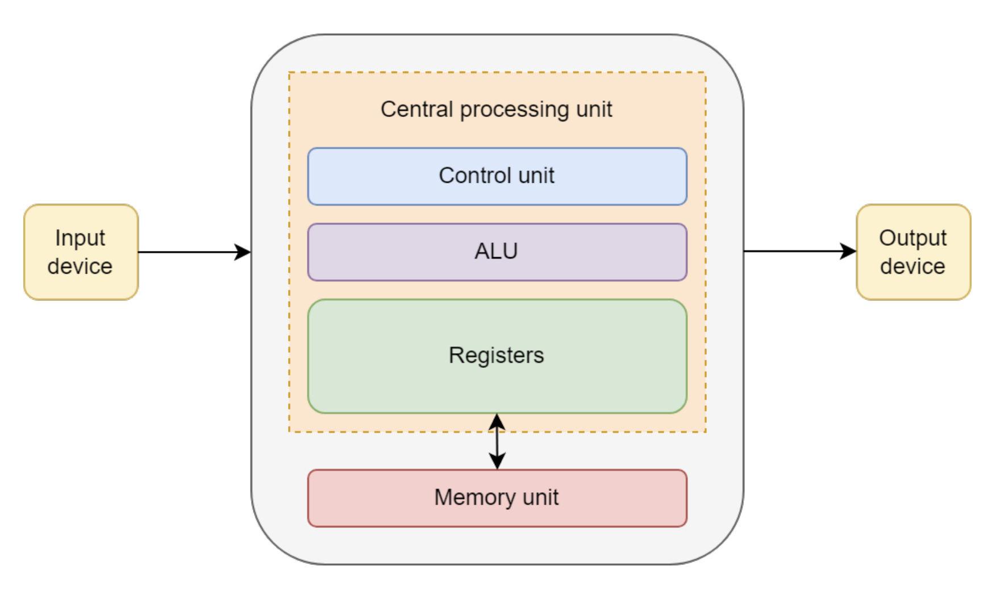
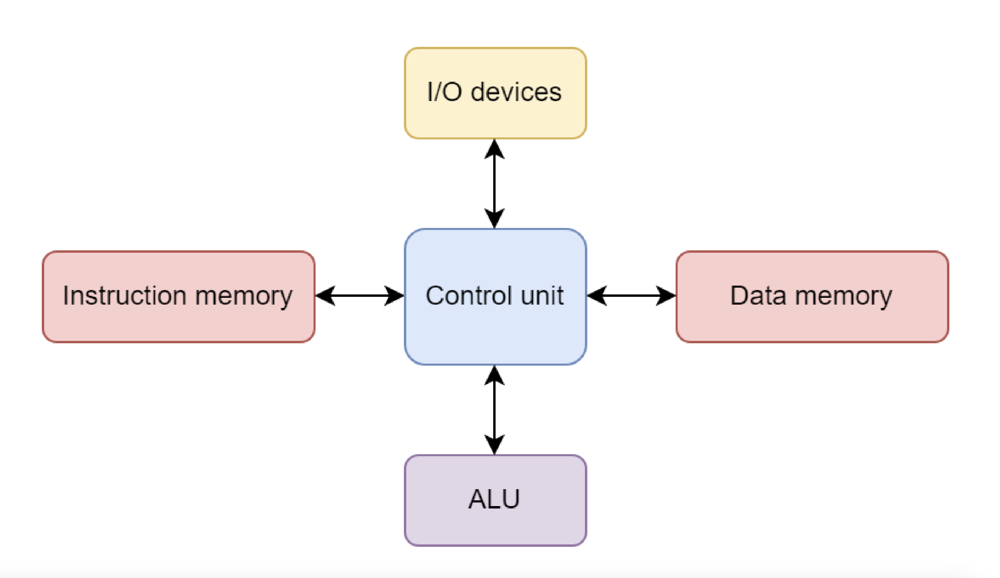
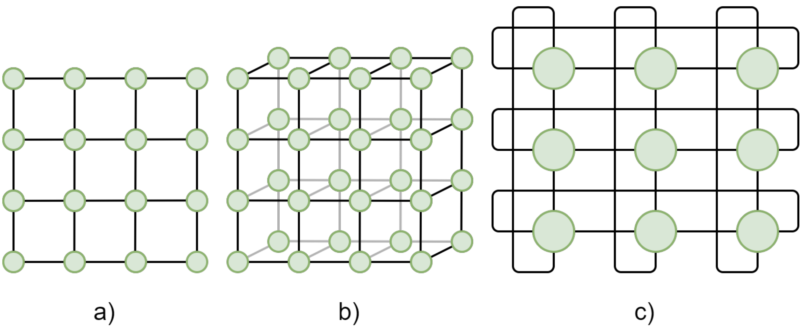
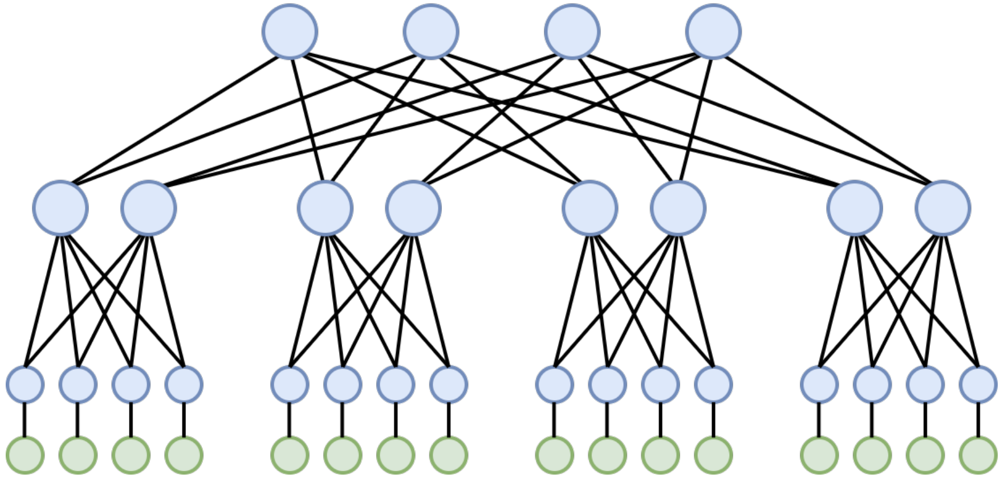

Simple, inexpensive computing tasks are typically performed **sequentially**, *i.e.*, where instructions are completed one after another in the order that they appear in the code, which is the default paradigm in most programming languages. For larger tasks that require many tasks to be executed, it is often more efficient to take advantage of the intrinisically parallel nature of most processors, which are designed to execute multiple processes simultaneously. Many common programming languages, including Python, support software that is executed in **parallel**, where multiple CPU cores are employed to perform tasks independently.

In modern computing, parallel programming has become more and more essential as computational tasks become more demanding. From protein folding in experimental drug development to galaxy formation and evolution, complex simulations rely on parallel computing to solve some of the most difficult problems in science. Parallel programming, hardware architecture, and systems admininstration come together in the multidisciplinary field of **high-performance computing** (HPC). In constrast to running code locally on your home machine, high-performance computing involves connecting to a cluster of computers elsewhere in the world that are networked together in order to run many operations in parallel.  

## Intro

### Computer Architectures

Historically, computer architectures can be divided into two categories -- von Neumann and Harvard. In the former, a computer system contains the following components:

- Arithmetic/logic unit (ALU)
- Control unit (CU)
- Memory unit (MU)
- Input/output (I/O) devices

The ALU takes in data from local memory from the MU and performs calculations, and the CU interprets instructions and directs the flow of data to and from the I/O devices, as shown in the diagram below. The MU contains all of the memory and instructions, which creates a performance bottleneck related to data transfer.

    
     
    Diagram of von Neumann architecture, from (\cite{https://onlinelibrary.wiley.com/doi/book/10.1002/9780470932025})

The Harvard architecture is a variant of the von Neumann design, where instruction and data storage are physically separated, which allows simulataneous access to instructions and memory. This partially overcomes the von Neumann bottleneck, and most modern central processing units (CPU) adopt this architecture.

    
     
    Diagram of Harvard architecture, from (\cite{https://onlinelibrary.wiley.com/doi/book/10.1002/9780470932025})

### Performance

Computational peformance is largely determed by three components:

- **CPU:** CPU performance is quantified by frequency, or "clock speed." This is determines how quickly a CPU executes the instructions passed to it in terms of CPU cycles per second. For example a CPU with a clock speed of 3.5 GHz peforms 3.5 billion cycles each second. Some CPUs have multiple **cores** that support parallelization by executing multiple instructions simultaneously (\cite{https://www.intel.com/content/www/us/en/gaming/resources/cpu-clock-speed.html})

- **RAM:** Random access memory (RAM) is a computer's short-term memory and stores the data a computer needs to run applications and open files. Faster RAM allows data to flow to and from your CPU more rapidly, and more RAM capacity helps the CPU complete complex operations simultaneously (\cite{https://www.intel.com/content/www/us/en/tech-tips-and-tricks/computer-ram.html}). 

- **Hard drive:** In contrast to RAM, a computer's hard drive is for long term data storage. Hard drives are characterized by their capacity and performance. Higher-capacity drives can hold more data and higher-performance drives read and write data faster. Hard disk drives (HDD) tend to offer more capacity at a lower cost, while solid state drives (SSDs) offer better performance and reliability. 

Processing astronomical data, building models and running simulations requires significant computational power.
The laptop or PC you're using right now probably has between 8 and 32 Gb of **RAM**, a processor with 4-10 **cores**, and a **hard drive** that can store between 256 Gb and 1 Tb of data. But what happens if you need to process a dataset that is larger than 1 Tb, or if your model that has to be loaded into the RAM is larger than 32 Gb, or if the simulation you are running will take a month to calculate on your CPU? You need a bigger computer, or you need many computers working in parallel.
  
## Flynn's Taxonomy: a framework for parallel computing
When we talk about parallel computing, it's helpful to have a framework to classify different types of computer architectures. The most common one is Flynn's Taxonomy, which was proposed in 1966 (\cite{https://ieeexplore.ieee.org/document/1447203}). It gives a simple vocabulary for describing how computers handle tasks, and will help us in understanding how certain programming models are better for certain problems.

Flynn’s taxonomy uses four words:
*   **S**ingle
*   **I**nstruction
*   **M**ultiple
*   **D**ata

These are combined to describe four main architectures (\cite{https://onlinelibrary.wiley.com/doi/book/10.1002/9780470932025}). For a thorough overview on these, you can refer to the HIPOWERED book. Let us go over them briefly,

*   **SISD (Single Instruction, Single Data):** This is a traditional serial computer, and is also called a von Neumann computer. It executes one instruction at a time on a single piece of data. Your laptop, when running a simple, non-parallel program, is acting as a SISD machine.
*   **SIMD (Single Instruction, Multiple Data):** This is a parallel architecture where multiple processors all execute the *same instruction* at the same time, but each one works on a *different piece of data*. This is the key to massive data parallelism.
*   **MISD (Multiple Instruction, Single Data):** Each processor uses a different instruction on the same piece of data. This architecture is very rare in practice.
*   **MIMD (Multiple Instruction, Multiple Data):** This is the most common type of parallel computer today. It has multiple processors, and each one can execute different instructions on different data, all at the same time. This is the architecture of a multi-core processor and of entire computing clusters.

In addition to these, a separate way in which parallel computers can be organized are:
1. Multiprocessors: Computers with shared memory.
2. Multicomputers: Computers with distributed memory.

### SIMD in Practice: GPUs

An important example of SIMD architecture in modern computing is the GPU (Graphics Processing Unit).

GPUs were originally designed for computer graphics, which is an inherently parallel task (for e.g., calculating the color of millions of pixels at once). Researchers soon realized this massive parallelism could be used for general-purpose scientific computing, including physics simulations and training AI models, leading to the term GPGPU (General-Purpose GPU). These allow for significant speedups in "data-parallel" models. The trade-off is that GPUs have a different memory hierarchy (with less cache per core compared to CPUs), meaning performance can be limited by algorithms that require frequent or irregular communication between threads.

A CPU consists of a few very powerful cores optimized for complex, sequential tasks. A GPU, in contrast, is made of thousands of simpler cores that are masters of efficiency for data-parallel problems. Because of this, nearly all modern supercomputers are hybrid systems that use both CPUs and GPUs, leveraging the strengths of each.

### Supercomputers vs. Computing Clusters

In the early days of HPC, a "supercomputer" was often a single, monolithic machine with custom vector processors. Today, that has completely changed, the vast majority of systems are clusters. Let us define some terms associated with this,
*   **Cluster:** A cluster is a collection of many individual, standard (SISD) computers (often called nodes) connected by a very fast, high-performance network. A modern supercomputer is a massive cluster. These are classified as multicomputers as they were originally built by connecting multiple SISD computers.
*   **Node:** A node is a single computer within the cluster. It has its own processors (CPUs), memory (RAM), and sometimes its own accelerators (GPUs). A typical compute node in a cluster today has two CPUs with multiple cores each.
*   **Workload Manager (or Scheduler):**  The entire cluster is managed by a special piece of software called a workload manager or scheduler, such as SLURM or PBS. Its job is to manage all the resources, handle a queue of jobs from many users, and decide when and where jobs will run. When submitting a job, it is the scheduler which reserves a set of nodes for the job for a certain amount of time.

### Network Topology for Clusters

Since a cluster is just a collection of nodes, the way these nodes are connected (called the **network topology**) is critical to performance. If any program needs to send data between nodes frequently, a slow or inefficient network will create a major bottleneck.

Common topologies for HPC include:

*   **Mesh:** Nodes are arranged in a two or three-dimensional grid, with each node connected to its nearest neighbors. This structure is illustrated in Figure 1 below, which shows examples of a 2D mesh, a 3D mesh, and a 2D torus (where the edges of the mash wrap around to connect the boundaries, forming a torus). 

    
     
    Figure 1: 2D and 3D meshes: a) 2D mesh, b) 3D mesh, c) 2D torus.

*   **Fat Tree:** The fat tree topology, shown in Figure 2, is widely used in large clusters. It is a hierarchical tree structure, but with "fatter" (higher bandwidth) links closer to the root to prevent network congestion when many nodes communicate simultaneously.

    
     
    Figure 2: Fat tree topology.

Other topologies which are less common for an HPC include Bus, Ring, Star, Hypercube, Fully connected, Crossbar and Multistage interconnection. More information can be found in the HiPowered book.

> ## Never Run Computations on the Login Node!
> When you connect to an HPC cluster, you land on a login node. This node is a shared resource for all users to compile code, manage files, and submit jobs to the workload manager. It is not designed for heavy computation!
> Running an intensive program on the login node will slow it down for everyone and is a classic mistake for new users. Your job must be submitted through the workload manager (e.g., using `sbatch` in SLURM) to run on the compute nodes.
{: .callout}

### File system

HPC clusters use a few different locations and formats for storage. 

- **Home directories:** HPC clusters allocate personal storage to individual users, though typically with limited capacity. This is a good place to store scripts and configuration files.

- **Scratch:** Scratch space is temporary storage that offers signifcantly larger capacity for active jobs and processing that is not backed up and usually deleted after job completion. Using scratch space is appropriate for: 

    - Jobs that require large storage capacity while running
    - Data sets that do not fit in personal storage but are not permanently needed
    - Jobs that need higher-performance storage than provided by personal storage

- **Shared:** Shared storage is accessible to multiple users. These spaces tend to be allocated to members of a research groups as a common working directory and are continuously backed up. 

\cite{https://www.hpc.iastate.edu/guides/nova/storage#:~:text=Home%20directories%20(/home),used%20for%20high%20volume%20access.})
\cite{https://services.dartmouth.edu/TDClient/1806/Portal/KB/ArticleDet?ID=140938}

## Which computer for which task?
- If you have an algorithm that requires the output from step A to start step B… (sequential code)
- If you have an algorithm that performs the same operation on a large volume of homogeneous data… (parallelizable code)
- If you have an algorithm that operates on vectors or matrices… (vectorization)

