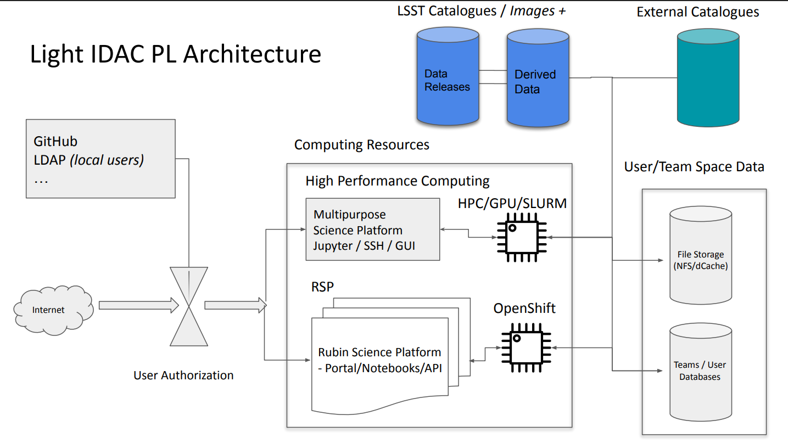
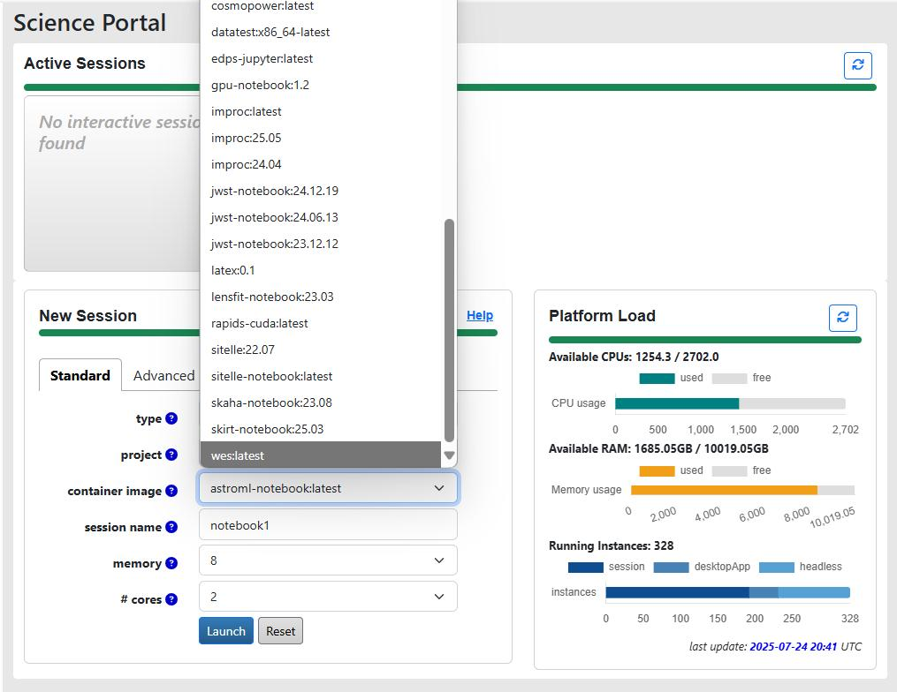

In the astronomical community, we often have local HPC facilities, most commonly institutional clusters, and for the members of large collaborations, there is usually a possibility to get accesss to large national-level supercomputers. Depending on the project you are part of, you can also have access to the funds for cloud-based HPC solutions, e.g. provided by Google or AWS. However, the LSST community as a whole also has in-house computational facilities that may be used for HPC purposes.

LSST In-Kind program is created to account for non-monetary international contributions to the development and operations of LSST. The idea behind this program is that each participating country has a commitment to contribute a certain amount of research and/or software development efforts, hours of observational time at their observatories, or computational and data storage resources, in exchange for the data rights for the LSST Data Releases for a fixed number of researchers from that country. Among the in-kind contributing teams, there are thirteen computational and data storage facilities. Most of them are considered to be Independent Data Access Centers (IDACs), whose main purpose is to store and provide access to the LSST data products; therefore, they do not always have a significant amount of CPUs or GPUs aboard. However, there are several of them which double as computation centers.

The full list of LSST computational and data storage in-kind contributions can be found in [this table](https://docs.google.com/spreadsheets/d/1r6JH0_5ROdSZ7I9_N4eSEHGbYgOO2QOwW_70IGo8RSg/edit?gid=0#gid=0). Let's have a look at the few with HPC capabilities.

### Poland IDAC
This light IDAC is located in Poznań Supercomputing and Networking Center (PSNC) and implemented as part of a KMD3/PraceLab2
system, that has about 25 PB of storage and ~6k CPU cores on board, with some GPUs also available. For the LSST users, about 470 CPU cores and about 5 PB of storage will be available. This IDAC is going to store Data Release tables and possibly deep coadd images, and provide access to its databases, CPUs and potentially GPUs with a deployed Rubin Science Platform, multipurpose Jupyter Notebook platform, and SSH connection to Slurm job manager for running code in an HPC mode. The development of this IDAC is in the testing stage. The functionality of this IDAC would be available to all LSST data rights holders. More information can be found [here](https://project.lsst.org/meetings/rubin2025/sites/default/files/RCW25%20-%20IDAC%20PL_0.pdf).

{: .image-with-shadow width="500px"}

Poland IDAC organization. Credit: <a href="https://project.lsst.org/meetings/rubin2025/sites/default/files/RCW25%20-%20IDAC%20PL_0.pdf">Poland IDAC RCW presentation</a>

### Brazilian IDAC (LineA)
The Brasilian light IDAC will host catalogs obtained from Data Release coadd images together with a number of secondary data products, such as photo-z catalogues, Solar System tables, catalogues for galactic science, etc. It is a branch of a multi-purpose astronomical platform [LineA](https://www.linea.org.br/idac-2) that already hosts datasets from SDSS, MaNGA, and DES, and provides access to SQL query instruments, Aladin Sky Viewer, Occultation Prediction database, Jupyter Notebooks running on Kubernetes with up to 4 CPU codes and 16 Gb RAM per session, and, upon approval, Jupyter Notebooks running in an HPC mode. 

The IDAC will have about 1 PB of user-available storage system and 500 CPU cores. Currently, the system is in beta-testing, but it can be already used by anyone with RSP credentials. 

### Canadian IDAC
The Canadian IDAC runs on top of the [Canadian Astronomy Data Centre (CADC)](https://www.cadc-ccda.hia-iha.nrc-cnrc.gc.ca/en/), which hosts data from multiple large-scale surveys, including JWST, HST, Gemini and CFHT. It is available to both Canadian and international users, which, in the case of LSST, means anyone with data rights. By the time of DR1, this IDAC is expected to have 3000 CPUs and 2 PB of long-term user storage dedicated specifically to LSST needs, however, this IDAC uses Jupyter Hub/Jupyter in containers approach, and the maximum amount of resources allocated to one session is up to 16 CPUs and 192 GB of RAM. A batch processing system for jobs is currently being tested, which allows access to larger resources. The most relevant information on this IDAC can be found in the [RCW presentation](https://docs.google.com/presentation/d/18VOG05kuNqeHtp55CPW5xACFWu0Tgox7/edit?usp=sharing&ouid=113160788641967249830&rtpof=true&sd=true).

{: .image-with-shadow width="500px"}

CANFAR service of the Canadian IDAC allows you to run notebooks with a project-specific environment. Credit: <a href="https://docs.google.com/presentation/d/18VOG05kuNqeHtp55CPW5xACFWu0Tgox7/edit?slide=id.g37138d149ef_0_109#slide=id.g37138d149ef_0_109">Canadian IDAC RCW presentation</a>

### Argentina IDAC
Argentina IDAC is envisioned to be an LSST data access point primarily for the Argentinian scientists, however, access can be granted to international collaborators upon agreement. It will carry 1024 CPU cores and 8 GPU Nvidia RTX 6000 Pro Blackwell GPUs, with 3.0 TB RAM and 0.75PB of long-term storage, and is currently being assembled with the planned start of operations in early 2026. The IDAC will host catalogues from the LSST Data Releases, with tentative plans to add object cutouts in the future. The job management will be done with Slurm.

### UK Data Facility
The UK Data Facility is, at the moment, the only IDAC that plans to host full LSST Data Releases, including epoch images, together with some user-generated data products. This IDAC does not provide HPC features out of the box - the interface is going to be very similar to the RSP, with Jupyter Notebooks having up to 4 CPU and 16 GB RAM allocated per user. However, batch analysis or ML capabilities from other UK-based facilities may be provided for certain projects. Currently, the IDAC is in preview mode, with the start of operations planned in the next few months.

### Croatian SPC (Scientific Processing Center) Bura
One of the Croatian in-kind contributions is computing time on the supercomputer Bura, which we will use during this workshop. Unlike the previous projects, this facility's primary function isn't data access, but running HPC calculations. This facility has about 7k CPU nodes with about 95 TB of cluster storage space, together with four GPU nodes. We will talk more about Bura in the next episodes.

### Which facility is the right choice for me?
It may seem logical to go for the largest supercomputer available to you, when you need to run some massive computations, however, in practice, there is a number of aspects to consider.

 1) Do you need some specific datasets? While obtaining more computational power is relatively simple (to a certain limit), data transfer is still one of the biggest bottlenecks. Transferring many terabytes of data is often problematic, even for large-scale facilities. If you need to perform data analysis on the whole LSST Data Release, especially if you are working with epoch observations, your choice of HPC is severely limited to a few IDACs that store these datasets. The same problem occurs if you need to crossmatch several large datasets.
 
 2) Can your algorithm be implemented on GPUs? If so, is the speed-up crucial? Currently, only a few LSST facilities promise access to GPU computation time, however, institutional clusters are often more advanced in this regard, thanks to the need to serve multiple scientific groups with varying interests. If you are running a Machine Learning algorithm, IDACs are usually not the best choice.
 
 3) Do you use `Python`, `C`, or some specific code, e.g. [`GADGET`](https://wwwmpa.mpa-garching.mpg.de/gadget4/)? Installing software packages on HPCs is less straightforward than it is on a personal computer (and even that is rarely as straightforward as we'd like). Before committing to an HPC facility, write a lightweight testing script that will check that all dependencies needed for your project work properly.


