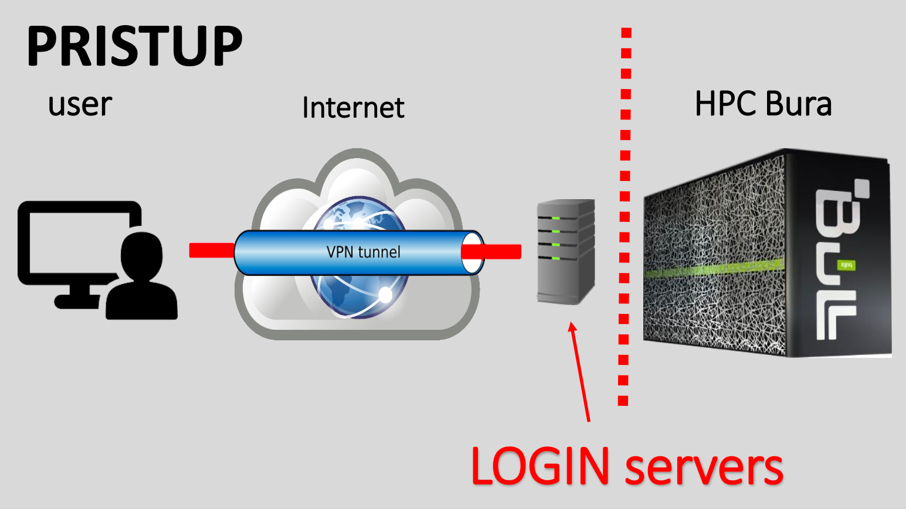
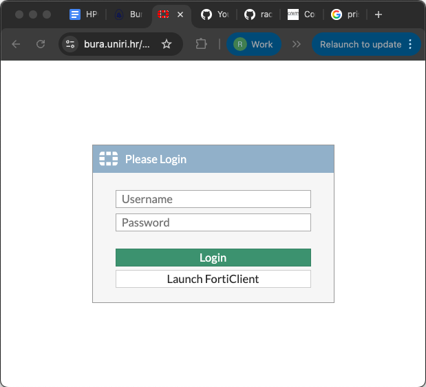
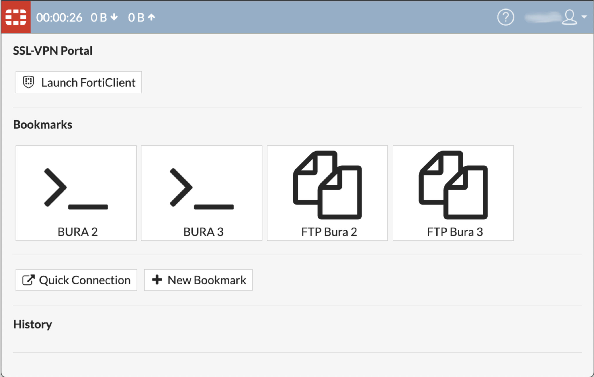
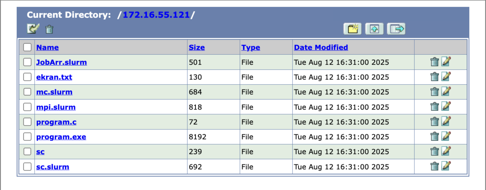
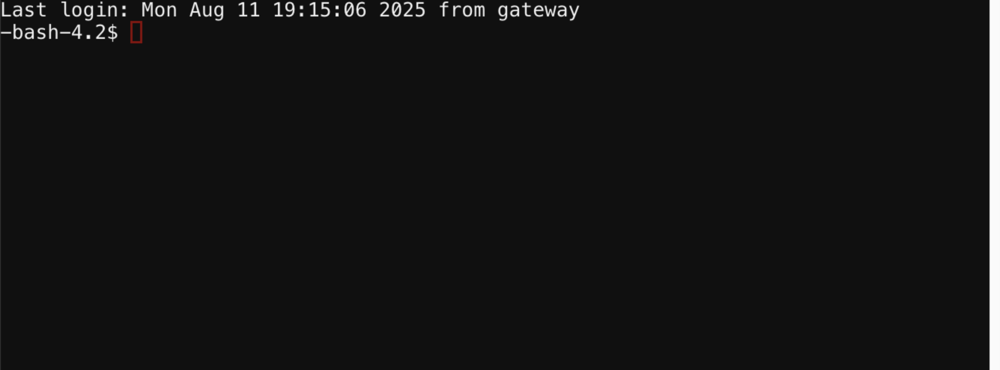
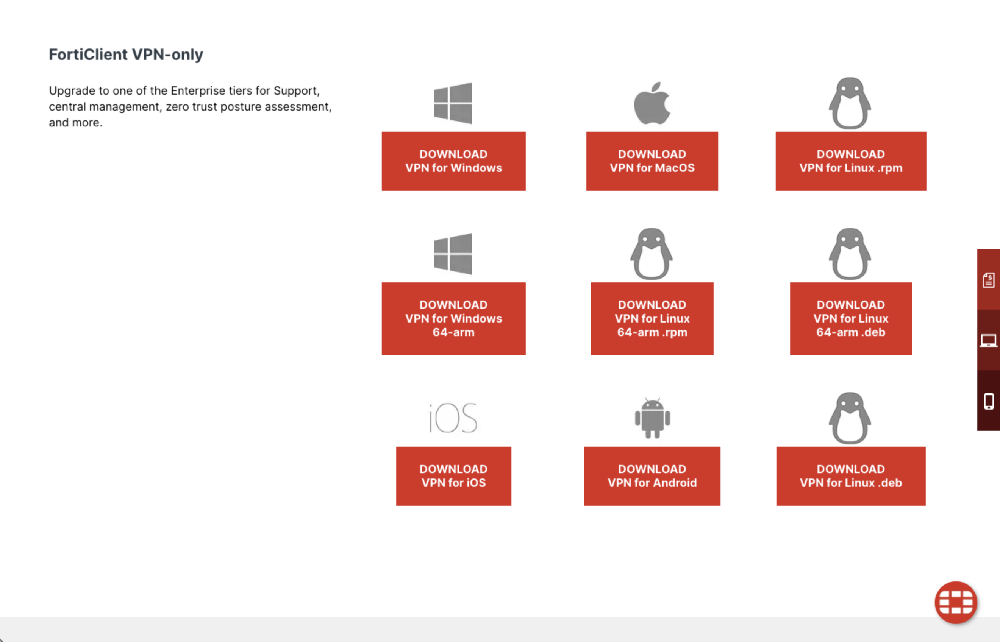

## Intro

Bura is a supercomputer at the Center for Advanced Computing and Modelling (CNRM), University
 of Rijeka, Croatia.  Access to this cluster is available to the Rubin Data Rights community
 through the LSST International In Kind Program.  The goal of this episode is to describe 
Bura's architecture and capabilities, and outline the procedure necessary to access the cluster. 
More detailed information on Bura, including tutorials, can be found [here](https://cnrm.uniri.hr/bura/).

## The Bura Supercomputer

Bura has a hybrid architecture consisting of three components:

* **Cluster**: The system consists of 288 compute nodes, each of which consists of two Xeon E5 
processors (with 24 physical cores and 48 threads per node). This gives a total of 6912 processor cores which can support 
up to 13824 threads. Each node has 64 GB of memory and 320 GB of Solid State Drive (SSD) 
disk space .  In total, the nodes have 18 TB of memory and 95 TB of disk space.

* **GPGPU (General-purpose computing on Graphical Processing Units)**: This component consists of 
four nodes, two comprising Xeon E5 processors (each with 8 cores/node) and two based on 
NVIDIA Tesla K40 general purpose GPUs.  64 GB of RAM is available, with 320 GB of SSD disk space.

* **SMP (Symmetric Multiprocessing)**: The third component is a multiprocessor system with a 
large amount of shared memory. The SMP component consists of 16 Xeon E7-8867 processors giving a 
total of 256 physical cores per node.  These have 6 TB of memory and 245 TB of local storage. 
Two SMP nodes are available.

In addition to the computing nodes, Bura provides some large data storage areas, both of which 
are accessible from all three components. The first is a 13 TB /home area, and the 
second is an 868 TB /scatch space. The latter is supported by a Lustre Infiniband parallel 
distributed filesystem.  

## Computing on Bura

Bura is designed to provide a multi-user, powerful general-purpose computing environment that 
can be used for a wide range of applications.  

It uses the [LMOD system](https://lmod.readthedocs.io/en/latest/) to dynamically manage user 
environmental modules.  This is used to manage user environment variables as well as software 
dependencies such as Python versions.

Users can run computing tasks on Bura by submitted jobs to its SLURM workload manager. 
[SLURM](https://slurm.schedmd.com/quickstart.html) is an open-source task management system 
that manages the available computing resources and dynamically schedules the computing tasks 
submitted by multiple users. 

We will cover how to configure and run tasks on Bura in subsequent episodes.  Firstly, 
we need to log into the system. 

## Accessing Bura

{: .image-with-shadow width="700px"}

There are two ways to access Bura:
* Using a Virtual Private Network (VPN)
* Through Bura's web-based portal.  

### Access through the web browser

You can access Bura simply by opening a new 
window or tab in your browser and typing Bura's URL into the address bar:

[https://bura.uniri.hr](https://bura.uniri.hr)

You should then see the login screen below, where you can enter your user credentials, and click 
the green "Login" button. 

{: .image-with-shadow width="700px"}

When you have logged in successfully, you will see the following screen:

{: .image-with-shadow width="700px"}

Please note that there are a few known issues with this method of accessing Bura.  
* Some shortcuts don't work due to the web browser,
* Some lines may be missing.  If so, try pressing CTRL-C, and resize the window.

The landing screen offers two options, and you can use either of the Bura2 or Bura3 ports. 

**FTP File transfer**

You can transfer files to Bura's storage areas by clicking on either of the FTP buttons. 
This will take you to the file system navigator screen, where you can access or add files to 
your user account's storage area on Bura. 

{: .image-with-shadow width="700px"}

**Starting a terminal session**

From the landing page, you can click either of the buttons marked ">_" to start a terminal
 session which will take you to a Unix-like command prompt.

{: .image-with-shadow width="700px"}

From here you can start your computing jobs.  We will cover how to do that in upcoming episodes. 

### VPN Access

Alternatively, you can access Bura independently of the web portal by setting up a VPN 
connection. This requires you to install VPN client software on the machine that you 
will connect from.  

The preferred VPN client is Forticlient, which supports all major operating systems:
* Windows XP, 7, Vista and 10
* Linux Debian, Ubuntu, Centos, Fedora, Redhat and more
* Android
* iOS
* Chromebook

[Click here to install Forticlient](https://www.fortinet.com/support/product-downloads#vpn)

{: .image-with-shadow width="700px"}

Once you have install Forticlient, open the app and use the GUI to add a new connection 
configuration. The details needed for this configuration were emailed to all workshop 
participants in advance. 

Once the VPN is configured and saved, click the "Connect" slider to open the VPN 
connection.  

Note that it is inadvisable to have multiple VPNs running at the same time, so if the 
connection is problematic, check to make sure you do not have a different VPN running 
in the background.  

### SSH Client

Once you have a secure VPN connection open, it is analogous to creating a secure, private
tunnel from your machine to Bura.  Traffic, i.e. your commands, can then be sent securely 
to Bura using the Secure Shell protocol, or SSH.  

There are a number of SSH client software packages available for different platforms.  
Here we list just a few, but you are welcome to use your preferred client:

* PuTTY (also SuperPutty, PuTTY Tray, KiTTY)
* Bitvise
* MobaXterm (free and pro versions available)
* SmarTTY (free)
* Dameware SSH Client (free and paid versions available)
* mRemoteNG (free)
* Terminals (free)

Whichever client you choose, you should configure the 'host' parameter to the IP address 
of either one of the two Bura login nodes (these were sent to workshop participants by 
email).  

Once you log in with your SSH client you should reach a terminal session and the Bura 
commandline prompt.  

> ## Exercise
> Securely log into the Bura cluster through either one of the options described above. Open a terminal session and use the commandline tools described in the previous exercise to list the contents of your home directory and create a new file.
> > ## Solution
> > ~~~
> > $ ls
> > -bash-4.2$ ls
> > ekran.txt  JobArr.slurm  mc.slurm  mpi.slurm  program.c  program.exe  sc  sc.slurm
> > $ nano
> > (Click CTRL-X to exit and save the file with a filename of your choice.)
> > ~~~
>>{: .language-bash}
>{: .solution}
{: .challenge}


