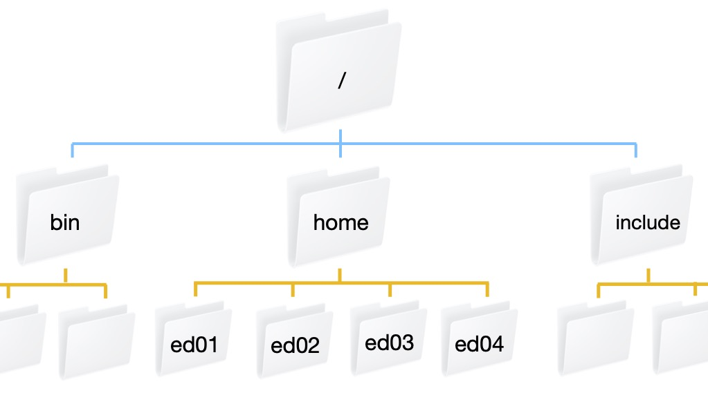

## Introducing the Shell

The shell or command line is a way to interact with a computer by typing text commands into a terminal or console window. This is in contrast to using a graphical user interface (GUI) with buttons and menus. Although many of the same tasks can be performed with both a shell interface or a GUI interface, the shell gives the most basic and universal access because it does not require any graphics. 
Whether you're navigating a High Performance Computing (HPC) repo, inspecting  files, or debugging processing failures, these shell commands will be indispensable.

You have already opened a shell to ssh into bura. Now that your shell is pointing to the bura file system, we will learn how to navigate it, manipulate files, and interrogate the machine for information about you, the file system, and the tasks it is running.

## File Navigation
When you view your file system via a graphical interface, you are used to clicking on one folder to look inside and then clicking on another folder inside that one. This folder (or directory) structure is called a directory tree. In the same way that you can click to navigate around your file system, you can type commands into the shell.

Bura is set up with a top level folder or directory `/`. There are a lot of directories in the the `/` directory including `bin`, `home`, and `include`. Our individual user directories are contained within the `home` directory. This figure shows what that directory structure looks like.

{: .image-with-shadow width="700px"}

### What directory am I in?
The `pwd` command stands for "print working directory". You can always use this command to ask the shell "where am I?" (you will be surprised how often this comes up).
```bash
$ pwd
```
```output
 /home/edu02
```

### What is in my directory?
The `ls` command is short for listing - this lists all of the files and directories in the directory that you are currently in. This is really helpful if you are looking for something or can't remember the name of a file or directory. 
```bash
$ ls
```
```output
 ekran.txt     mc.slurm   program.c    sc JobArr.slurm  mpi.slurm  program.exe  sc.slurm
```
You can execute this command not only to list all items in your current directory, but in other directories as well. For this, just add the path to the needed directory after the command:

~~~
$ ls /home
~~~
{: .language-bash}

By default, `ls` does not show you any directories or files starting with `.`. These are called hidden files and directories. If you want to see everything, even the hidden files, you can use the `-a` flag (for all).
```bash
$ ls -a
```
```output
.  ..  .bash_history  ekran.txt  JobArr.slurm  mc.slurm  mpi.slurm  program.c  program.exe  sc  sc.slurm
```

Another useful option is `-F` flag - this adds symbols to the output to identify different types of entries. For example it will put a `/` after directories. 

> ## Using Multiple Flags
> Sometimes you want to use more than one flag for a command (for example maybe you want to use the `-a` and `-F` flags) to show all hidden files and tell you which ones are directories. If the flag is a single letter then you can string them together like `ls -aF` or if you prefer you can write `ls -a -F`. The order you put the flags in doesn't matter.
{: .callout}

### Creating a Directory
When you start a project one of the first things you want to do is set up directories to organize it. For example, you may want a top level directory for the project and then sub-directories for data and code. When you log onto another computer you should not put everything in your home directory. A little organization at the beginning can save you a lot of time later when you try to figure out which files belong to what project. You can create a new directory using the `mkdir` command (for make directory). Let's make a directory for the work we do in this course:
```bash
$ mkdir hpc_course
```

> ## Spaces in directory names
> You may have noticed that we separate different parts of a command with spaces. The command line uses spaces to parse each part of the command. For this reason, you should not create directories with spaces in them, because if you then try to do something with them from the command line you need to add special characters to group the multiple words together. It is common to use underscores or dashes between words. 
{: .callout}

### Changing Directories
Creating a directory does not move you into the new directory. To change directories you use the `cd` command. For example:
```bash
$ cd hpc_course
```

To move backwards (or up) a directory (for example to move back to your home directory) use `cd ../`

> ## Exercise
> If you have not already done so, move into your `hpc_course` directory. Verify that you are in the correct directory, then create two new directories: code and data. Verify that your directories have been created.
>> ## Solution
>> ~~~
>> if you haven't already, move into your hpc_course directory. 
>> $ cd hpc_course
>>
>> $ pwd
>> /home/edu02/hpc_course

>> $ mkdir code
>> $ mkdir data
>> $ ls
>> code  data
>> ~~~
>>{: .output}
> {: .solution}
{: .challenge}

> ## Using tab to auto-complete
> It can be tiring to type out the name of every file and every directory and it can also be frustrating when you mistype a word. The shell will auto-complete a filename or directory name if you have typed enough of the word to uniquely define it by pressing the tab button. If there is more than one possibility, press the tab button twice to display the different options.
{: .callout}

### Going backwards
Once you have gone into a directory, how do you get out? `../` is the shells way of saying "go back a directory". For example, we are currently in the `hpc_course` directory. If you type `cd ../` you will be in your home directory.
```bash
$ pwd
 /home/edu02/hpc_course

$ cd ../
$ pwd
/home/edu02

$ ls
ekran.txt  hpc_course  JobArr.slurm  mc.slurm  mpi.slurm  program.c  program.exe  sc  sc.slurm

$ cd hpc_course
```

## Printing to the screen
Sometime you want to write a message to the screen. This can be done with the `echo` command with the format `echo <thing to print>`. For example, to print "hello world":

```bash
$ echo "hello world"
```
```output
 hello world
```

## File Manipulation
### Shell scripts
Let's create a simple script that prints "hello world" to the screen. 
Just like you can write a script in python that executes a series of python commands, you can write a shell script: a text file  that contains a series of shell commands. Shell scripting can be very useful in science, including:
- **Reproducibility** – Shell scripts can be saved and re-executed at a later date. Commands executed in the shell are also saved and can be referred to later. 
- **Throughput** – Many tasks in science are repetitive. For example, if we were conducting a calculation on 100 samples and wanted to do some simple statistics on reads, we could use loops to perform this task on all sets of reads. This is much quicker than using a GUI.
- **Integration** – Shell scripting allows you to integrate several programs into workflows.
- **Efficiency** – GUIs can be resource-intensive. Using the shell frees resources that would otherwise be used for the GUI.

Shell scripts are text files that contain shell commands. Our first shell script will print "hello world" to the screen, wait 2 seconds and then exit. We will use the text editor nano. The great thing about nano is that it tells you how to save and exit in the screen, it is also ideal for ssh as it opens directly in the shell window you are using. Here are the most commonly used nano commands:
- `Ctrl + O` — Save
- `Ctrl + X` — Exit
- `Ctrl + K` — Cut line
- `Ctrl + U` — Paste line

```bash
$ nano shell_example.sh
```
```output
hello world
```

In the window that pops up, let's type `echo "hello world"` and save and exit. To run your shell script, type:
```bash
$ source shell_example.sh
```
```output
hello world
```

### Pausing for a minute
Sometimes you want your shell script to wait for a little while for a process to finish before it continues with the rest of the commands. The `sleep` command suspends execution for a specified number of seconds. For example, if you wanted to pause for 5 seconds, you can type:

```bash
$ sleep 5
```

This will wait 5 seconds and then return your cursor to the command line.

> ## Exercise
> Use nano to edit your shell_example.sh file to sleep for 2 seconds after it prints "hello world"
>> ## Solution
>> ~~~
>> $ nano shell_example.sh
>> add as a new line
>> sleep 2
>>
>> Test your new script
>> $ source shell_example.sh
>> hello world
>> ~~~
>> {: .output}
>{: .solution}
{: .challenge}


Oops - we just create that script in our top level directory and it belongs in our code directory (because it is a piece of code). We can move the file to the code directory with the `mv` command. The format is `mv` thing-you-want-to-move where-you-want-to-move-it
```bash
$ mv shell_example.sh code
```
`mv` can also be used to rename a file, you can think of this as moving it from one file name to another filename. In this case where-you-want-to-move-it is the new name of the file. Let's rename the file to something more descriptive `hello_world.sh`. Don't forget we moved the file to our code directory, so we have to go there first before we can rename it.
```bash
$ ls
code  data

$ cd code
$ ls
shell_example.sh

$ mv shell_example.sh hello_world.sh
$ ls
shell_example.sh
```
Instead of moving or renaming a file, you can create a copy of the file with the `cp` command. The format is the same as `mv`
```bash
$ cp hello_world.sh hello_world_copy.sh
$ ls
```
```output
hello_world_copy.sh  hello_world.sh
```
> ## including paths in cp and mv
> You do not always have to be in a directory to copy or move a file. If the file you want to move is not in your current directory, you can refer to the file you want to move with both the path from your current directory and the filename. Similarly, where you want to move a file can also include a path. Let's say I was in my `hpc_course` directory and I want to copy my hello_world.sh file to hello_world_3.sh. The format looks like this: 
> ```bash
> $ pwd
> /home/edu02/hpc_course/code
> 
> $ cd ../
> $ cp code/hello_world.sh code/hello_world_3.sh
> ```
{: .callout}

### deleting files
You may accidentally create file and want to delete it. This can be done with the `rm` command which stands for remove. Be careful, the `rm` command permanently deletes a file - this is not like putting it in the trash can or recycle bin where you can recover it. For that reason, we recommend you use the `-i` flag which double checks with you before it deletes a file. Now we can remove our hello_world_3.sh file.

```bash
$ cd code
$ ls 
hello_world_copy.sh  hello_world.sh  hello_world_3.sh

$ rm -i hello_world_3.sh
rm: remove regular file ‘hello_world_3.sh’? y

$ ls
hello_world_copy.sh  hello_world.sh
```

> ## Exercise
> Use nano to edit your hello_world_copy.sh file to print something else. Rename your file to something descriptive of what it prints. Run your new code.
>> ## Solution
>> ~~~
>> nano hello_world_copy.sh
>> 
>> change "hello world" to "hello universe!"
>> Save and exit
>> 
>> mv hello_world_copy.sh hello_universe.sh
>> $ ls
>> hello_universe.sh  hello_world.sh
>>
>> $ source hello_universe.sh
>> ~~~
>> {: .output}
>{: .solution}
{: .challenge}

## File permissions - who owns what?
Different files on different systems belong to different people and you don't want anyone to be able to do anything to any file. File permissions restrict access to files and directories based on an individual or a defined group. This is like having a locked office door. There are 3 types of permissions: read (r), write (w), and execute (x). Reading a file allows you to look at the file (or directory) but not modify it. Write permissions allow you to modify the file (or directory). Execute allows you to execute a script. There are also 3 sets of permissions to set: permissions for the owner of the file, permissions for the group that the file belongs to, and permissions for everyone else. Let us take a look at the permissions of the files in our directory. To view the current permissions you can type:

```bash
$ ls -l
```
```output
total 8
-rw-rw-r-- 1 edu02 edu02 32 Aug 16 06:31 hello_universe.sh
-rw-rw-r-- 1 edu02 edu02 28 Aug 16 06:25 hello_world.sh
```
The output has the following format `<type><permissions> <link> <owner> <group> <size> <date modified> <name>`. The first character is the type - we will skip this and go directly to the 9 characters after that. The first three are the permissions for the owner. They will always be listed in the order read, write, and execute. If the letter is there than that permission is enabled. For instance if the first three characters were `rw-` then the owner would have permission to read and write a file or directory but not permission to execute it. The next three characters are the groups permissions. Anyone who belongs to the group listed in the fourth column is assigned these permissions. The permissions work the same way as the owner's permissions. For instance, if the middle three characters are `r-x` then anyone in the group has permission to view the file and to execute it, but not to modify it. Finally, the last three characters are for everyone else. 

> ## What groups do I belong to?
> To figure out what groups you are part of (which can be useful to understand if you have permission to do something) you can type 
> ```bash
> $ groups
> edu02
> ```
{: .callout}

You modify the permissions on a file or directory using the `chmod` command. You pass to this command whose permissions you want to modify, owner (o), group (g), everyone else (o), or all users (a), what permission you want to modify (r, w, or x) and whether you want to add (+) that permission or remove (-) it. For example, to give everyone else the ability to execute our hello_world.sh script we would type:

```bash
$ ls -l hello_world.sh
-rw-rw-r-- 1 edu02 edu02 28 Aug 16 06:25 hello_world.sh

$ chmod o+x hello_world.sh
$ ls -l hello_world.sh
-rw-rw-r-x 1 edu02 edu02 28 Aug 16 06:25 hello_world.sh
```
> ## Exercise
> What are the permissions on the `hello_universe.sh`? Who owns the file? What group does it belong to? Modify the permissions to remove the groups ability to read the file. Double check that the permissions changed. Then add the permissions back.
>> ## Solution
>> ~~~
>> $ ls -l hello_universe.sh
>> -rw-rw-r-- 1 edu02 edu02 32 Aug 16 06:31 hello_universe.sh
>>
>> $ chmod g-r hello_universe.sh
>> $ ls -l hello_universe.sh
>> -rw--w-r-- 1 edu02 edu02 32 Aug 16 06:31 hello_universe.sh
>> 
>> $ chmod g+r hello_universe.sh
>> $ ls -l hello_universe.sh
>> -rw-rw-r-- 1 edu02 edu02 32 Aug 16 06:31 hello_universe.sh
>> ~~~
>>{: .output}
>{: .solution}
{: .challenge}

> ## Ethical usage of HPCs
> Depending on the permissions set, you may see directories belonging to other users, and sometimes access their content. Simultaneously, other users may have access to your files. Keep this in mind when storing non-public data, such as observations and data releases that are still protected by Data Rights agreements, on third-party computational facilities. Similarly, be mindful when browsing the directories open to you of the possibility that some reading and writing permissions might have been set by mistake.
{: .callout}

## Understanding what is happening on the whole system
Later in this lesson you will learn how to monitor specific tasks that you run on the HPC. Sometimes you want information about the file system or what processes are running outside of the HPC task manager.
When you are working on an HPC you are using a shared resource. It can be helpful to know how much of that resource you are using. You can do this with the `du -h <directory>` command. The -h makes the output format human readable (e.g. the size is in Kb, Mb, Gb). First, we will look at the size of our home directory.

### How much space am I using?
```bash
$ du -h /home/edu02
```
```output
8.0K	/home/edu02/hpc_course/code
0	/home/edu02/hpc_course/data
8.0K	/home/edu02/hpc_course
52K	/home/edu02
```
> ## Interrupting a command
> Help! you forgot to add a directory and now it is printing the size of every file. `ctl+c` will interrupt the command and return your cursor and command line.
{: .callout}

### What processes are running and how are they using the HPC?
Another really useful command is seeing what processes are running and who is running them. You can do with the `top` command. 
```bash
$ top
```
The important parts of the output are the PID (process id), USER (who is running the process), %CPU (what percentage of the CPU is being used by that process), %MEM (what percentage of the memory is being used by that process), TIME (how long has the process been running), and COMMAND (what is the command that was run). If you are worried something you did is taking too long or the computer is running slower than you expect, running `top` is a really good way to get an overview of who is doing what on the system. Note that this will continue to run until you tell it to stop. Type `q` to exit.

### Environment variables
Sometimes you have files and/or paths that you want multiple scripts (in different files) to point to. Instead of hard-coding these in every file, you can create an environment variable that each script can look at to get the file or path name. This means that if you decide to change the path or file, you just have to do it in one place instead of multiple places where its easy to miss one. To view an environment variable that has already been created, you can use `echo` and the environment variable, preceded by the `$`. Environment variables are conventionally all upper case. For example, one environment variable that is commonly used is the `PATH` variable. This tells your shell which directories and sub directories to search to find a command you type. Let us look at what is in our `PATH` variable by default:
```bash
$ echo $PATH
```
```output
/usr/local/bin:/usr/bin:/usr/local/sbin:/usr/sbin:/home/edu02/.local/bin:/home/edu02/bin
```

To create an environment variable, you use the `export` keyword with the syntax `export ENV_VARIABLE=value`:
```bash
$ export DATA_DIR=/home/edu02/hpc_workshop/data
$ echo $DATA_DIR
```
```output
/home/edu02/hpc_workshop/data
```
This creates the variable for an individual shell window. If you exit that window, the variable disappears. If you want to make a permanent variable, you can copy and paste the entire export command into your `.bashrc` or `.bash_profile` file. This is an invisible file that lives in your home directory and is executed every time you open a shell window; since these files are invisible, you need to use
`ls` with an `-a` flag to see them, and to edit them, you have to add a dot before the file name, e.g. `nano ~/.bashrc`.

> ## Does creating a variable create the directory?
> No matter whether you defined the variable only for the duration of the terminal session or in your `.bashrc` file, it is only a variable. The directory itself does not exist unless you
> run `mkdir` command. Try executing `cd $DATA_DIR` - you will get an error, notifying you that this directory does not exist.
{: .callout}

> ## Help! I over wrote my PATH variable and now nothing works
> The `PATH` variable tells your shell where to find all of its commands. If you overwrite this, a lot of things break. For this reason you usually append or prepend to your `PATH` variable rather than overwriting it entirely. If you overwrite it you can always close the shell window and reopen it. To append a directory to your `PATH` variable use the `:` between `PATH` and the new directory. For example, to add a `code` directory to the end of our path we can type:
> ```bash
> $ export PATH=$PATH:/home/edu02/hpc_workshop/code
> ```
> where `edu02` is replaced with your Bura user name.
> Even if this directory does not exist (as it is in our case), nothing breaks, however, the shell will search for the available commands in these non-existing directories as well every time you run a command. 
{: .callout}

## Getting files to and from the HPC
HPCs are a great resource for computing - but they are not a long term storage solution. You will want to move the files from the HPC to a file system that you control. You may also want to prototype a script locally and then move it to the HPC and run it. There are three ways you can move files back and forth: `scp`, `rsync`, and using GitHub (or other version control).

`scp` stands for secure copy. The command format is `scp <what you want to copy> <where to put it>` and these paths are always specified from where you are. Because you will be going from one system to another - one of the locations will include both the address to the system and the path, separated by a colon. For this part, we will exit Bura. Type `exit` to return to your local shell.

Now we will use `scp` to copy our `hello_world.sh` script to our local directory (`.`). After executing the `scp` command you will be asked for your password. Use your ssh password. 
```bash
$ scp edu02@172.16.55.121:/home/edu02/hpc_course/code/hello_world.sh .
```
```output
 edu02@172.16.55.121's password: 
 hello_world.sh                                     100%  130     0.1KB/s   00:01
```


Another option for moving files is `rsync`. This actually checks that the file or directory has been updated and only moves new things. The format is the same as `scp`: `rsync <what you want to copy> <where to put it>`.

Another option for moving files is the file transfer protocol `ftp` and secure file transfer protocol or `sftp`. This allows you to actually log onto the HPC and upload files from your machine or download them from the HPC to your local machine. To use `sftp` basic syntax is `sftp user@address`. You will then be promted for your password. Once you are logged in you can interact with the shell with basic commands like `ls` and `cd`. To download a file from the HPC to your local computer type `get <filename>`. To upload a file from your local machine to the HPC, type `put <filename>`

Finally, if you are using version control to track your development and have a remote server (e.g. GitHub, Bitbucket). Then you can use this to create another copy of your repository on the HPC and transfer files via the remote server.

> ## Exercise
> Use `scp` or `rsync` to move the files you downloaded for this course to Bura.
>> ## Solution
>> ~~~
>> $ TODO: FILL IN HERE MEET
>> ~~~
>> {: .output}
>{: .solution}
{: .challenge}()

> ## Other really useful commands that we do not have time to cover
> As you start using an HPC, you might want to check out these commands:
> learning about different command: `man`
> Viewing files: `head`, `tail`, `less`, `cat`
> Finding things: `grep`, `find`
> Changing ownership: `chown`
> System management: `df`, `free -m`, `ps`, `kill`
> See the Command Line Interface (CLI) in the Extras menu for even more!
{: .callout}



