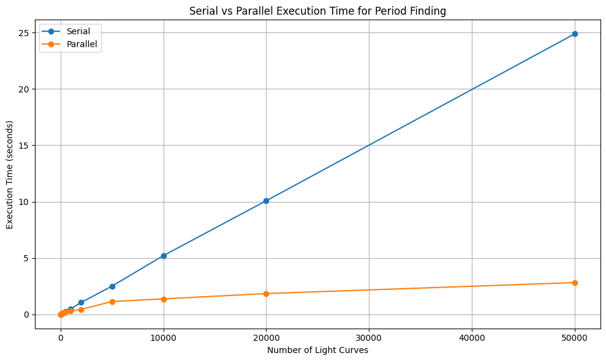

## Parallel CPU Programming

In the previous section, we saw how to make our code faster for sequential jobs. However, there are cases where, no matter how much you optimize, a single process remains a bottleneck. In such cases, we move to parallelization instead of vectorization, especially when computations involve dependencies or irregular structures that cannot be expressed as simple array-wide operations. Some tasks are even _embarrassingly parallel_ meaning they consist of completely independent jobs that you can run side by side, on different CPU cores or separate computers, without any communication.

A perfect example from astronomy is finding stellar variability period from their light curves (measurements of brightness over time). Analyzing one star is quick, but analyzing data from thousands or millions of stars sequentially can take days or weeks. This is where parallel computing becomes essential.

### Analyzing Light Curves with Sequential and Parallel Execution  

In astronomy, analyzing **light curves** (the time and brightness data plot of objects in the night sky) is a fundamental task. One common goal is to determine the most likely **period** of variability, which tells us how often an object repeats its brightness changes.  

#### The Lomb–Scargle Periodogram  
To detect periodic signals in light curves, we often use the **Lomb–Scargle periodogram**.  

- A periodogram is a plot of **power vs. frequency (or period)** that shows how strongly a sinusoidal signal at a given frequency fits the data.  
- The Lomb–Scargle method is especially important in astronomy because it works well for **unevenly sampled data** — a common situation since telescopes can miss nights due to weather, daylight, or scheduling.  
- Peaks in the periodogram indicate likely periods of variability, helping us detect signals from variable stars, exoplanets, pulsars, and more.  

#### Sequential vs. Parallel Execution  
There are two ways to compute the periodogram for many light curves:  

- **Sequential execution**: analyze one light curve at a time, moving through the dataset in order.  
- **Parallel execution**: split the dataset so that multiple CPU cores each analyze a subset of light curves simultaneously.  

Below you can see how the execution time scales up while using the sequential execution vs the parallel execution for detecting the periods of lightcurves using the **Lomb–Scargle periodogram**



From the plot, we can make the following remarks: 
- For smaller numbers (10, 50, 100, 200, 500, 1000, 5000), the execution time is almost the same for both sequential and parallel runs which are denoted by the blue and the orange lines respectively. 

- This happens because starting and managing parallel jobs has a small extra cost (called *overhead*).  

- As the number of light curves grows larger (beyond 5000), the benefit of parallelization becomes clear.  

- In the plot:
  - **Sequential time** keeps increasing steadily as the workload grows.  
  - **Parallel time** stays much flatter, showing that multiple processes share the work efficiently.  

> ## Computational Complexity  
> The efficiency of both **light curve processing** and the **Lomb–Scargle algorithm** depends on their computational complexity.  
> - For many simple data processing tasks, the time required grows roughly as **O(n)**, meaning if you double the number of data points, the computation takes about twice as long.  
> - Other algorithms are more expensive, following **O(n²)** scaling, where doubling the data points makes the computation **four times longer**.  
> - The **classical Lomb–Scargle periodogram** has a complexity of about **O(n × m)**, where *n* is the number of data points in a light curve and *m* is the number of trial frequencies tested. In practice, this often behaves closer to **O(n²)** for dense frequency searches.  
> - More modern implementations (like the *fast Lomb–Scargle*) use mathematical tricks to reduce the scaling closer to **O(n log n)**, making them far more efficient for very large datasets.  
> - Understanding complexity is crucial: it tells us when parallelization will give modest gains (e.g., for O(n) tasks) and when it becomes essential (e.g., for O(n²) or worse).  
> - **Parallelization reduces effective complexity** by dividing the work across multiple CPU cores.  
>   - For example, if a task is **O(n²)** on one processor but can be spread across *p* processors, the effective runtime becomes closer to **O(n² / p)**.  
>   - While it doesn’t change the theoretical scaling, it *reduces the constant factor dramatically*, making otherwise infeasible computations practical.  
> - For small tasks, parallelization does not save time (and may even cost a little extra).  
> - But as the workload grows, parallelization provides a much more efficient workflow.
{: .callout}

## Parallel Programming on CPUs

Parallel programming on CPUs is primarily achieved through two widely-used models:

### OpenMP (Open Multi-Processing)

OpenMP is used for shared-memory parallelism. It enables multi-threading where each thread has access to the same memory space. It is ideal for multicore processors on a single node.

OpenMP was first introduced in October 1997 as a collaborative effort between hardware vendors, software developers, and academia. The goal was to standardize a simple, portable API for shared-memory parallel programming in C, C++, and Fortran. Over time, OpenMP has evolved to support nested parallelism, Single Instruction Multiple Data (vectorization), and offloading to GPUs, while remaining easy to integrate into existing code through compiler directives.

OpenMP is now maintained by the OpenMP Architecture Review Board, which includes organizations like Arm, AMD, IBM, Intel, Cray, HP, Fujitsu, Nvidia, NEC, Red Hat, Texas Instruments, and Oracle Corporation. OpenMP allows you to parallelize loops in C/C++ or Fortran using compiler directives.

> ## No OpenMP for Python?
> While OpenMP is not supported by Python, there are other Python tools that use similar logic. In many cases, when you need to run complex data processing as efficiently as possible, you can use [multiprocessing](https://docs.python.org/3/library/multiprocessing.html) package that allows you to split your dataset into chunks and send them to be processed by different CPU cores.
> `multiprocessing` is a higher-level tool than OpenMP, in the sense that it doesn't do any kind of optimization on the level of data structures. When performance is really critical, lower-level tools give you more control, but when you want to speed up a processing of a large table from a week to one night, `multiprocessing` will do the job.
{: .callout}

> ## Terminology
> #### Nested Parallelism
> - Nested parallelism occurs when a parallel task itself spawns additional parallel tasks. For example, imagine a program where each thread is responsible for a different data block, and within each block, more threads are launched to handle sub-tasks. This is useful when dealing with hierarchical or recursive algorithms but must be managed carefully to avoid performance penalties due to thread overhead.
> 
> #### Single Instruction, Multiple Data (SIMD) – Vectorization
> - SIMD is a form of data-level parallelism where the same instruction operates on multiple data elements simultaneously. For instance, instead of adding two numbers at a time, SIMD allows processors to add pairs of numbers in parallel using wide registers (like 128-bit or 256-bit). Vectorized operations using NumPy or compiler intrinsics take advantage of this under the hood to speed up loops.
> 
> #### Offloading to GPUs
> - Offloading refers to transferring compute-intensive tasks from the CPU to the GPU, which is optimized for parallel processing. This is particularly effective for operations that can be executed simultaneously on thousands of threads, like matrix multiplications in deep learning or simulations in scientific computing. Tools like CUDA, OpenCL, or libraries like CuPy and PyTorch help achieve this in Python.
{: .callout}

### Example: Running a loop in parallel using OpenMP    
```c
#include <stdio.h> // For the standard input-output header file (can be thought of as a python library)
#include <omp.h> // For the OpenMP header file (can be thought of as a python library)

int main() {
    int N = 100000;                  // Size of the arrays
    double b[N], c[N], a[N];         // Input and output arrays are defined with fixed lengths

    // Initialize arrays b and c
    for (int i = 0; i < N; i++) {
        b[i] = i * 0.1;
        c[i] = i * 0.2;
    }

    // Parallel loop: compute a[i] = b[i] + c[i]
    #pragma omp parallel for
    for (int i = 0; i < N; i++) {
        a[i] = b[i] + c[i];
    }

    // Print first few values to check
    for (int i = 0; i < 10; i++) {
        printf("a[%d] = %f\n", i, a[i]);
    }

    return 0;
}

```

Since C programming is not a prerequisite for this workshop, let's break down the parallel loop code in detail.

**Requirements**:  
- Add `##include <stdio.h>` to your code
- Add `#include <omp.h>` to your code
- Compile with `-fopenmp` flag

Before we look at the explanation of the C code, we will first look at the Python Equivalent of this code

### Python Equivalent of the Code Logic 
 ```python 
def add_arrays(b, c):
     """
     Takes two lists `b` and `c`, adds corresponding elements, 
     and returns the resulting list `a` where a[i] = b[i] + c[i].
     """
    # Make sure both lists are the same length
    assert len(b) == len(c), "Input arrays must be the same length"

    # Create an output list of the same size
    a = [0.0 for _ in range(len(b))]

    # Loop through and compute a[i] = b[i] + c[i]
    for i in range(len(b)):
        a[i] = b[i] + c[i]

    return a

 # Example usage
 N = 100000
 b = [i * 0.1 for i in range(N)]
 c = [i * 0.2 for i in range(N)]

 a = add_arrays(b, c)

 # Print first few values to verify
 print(a[:10])
```
In this code snippet, we first define an `add_arrays` function that sums two lists element-wise, 
and then in the main part of the script we define `b` and `c` lists and execute `add_arrays` function. We are treating Python _lists_ as _C arrays_ here,
in the sense that we are doing something unusual for Python when we first define an empty 'placeholder' `a`, and then assign new values to each element of the list in
the `for` loop. The reason we are doing this and not `a.append(b[i] + c[i])` is because we want to preserve each step of the original `C` code, and in `C` and `C++` 
there is no possibility to do something like `append` to the `C` or `C++` _plain_ array 
(although there are variable types that allow this behavior, allocating memory in advance is much more efficient). 

> ## Explanation of the C code
>
> - `#include <stdio.h>`: Allows use of `printf` for output.  
> - `#include <omp.h>`: Includes the OpenMP API header needed for parallel programming.  
> - `int N = 100000;`: Defines the size of the arrays.  
> - `double b[N], c[N], a[N];`: Declares three arrays of size `N` (two inputs and one output).  
> - The first `for` loop initializes arrays `b` and `c` with values (`i * 0.1` and `i * 0.2`).  
> - `#pragma omp parallel for`: A **compiler directive** that tells the compiler to **parallelize the `for` loop** that follows.  
> - The second `for` loop computes element-wise addition: `a[i] = b[i] + c[i]`.  
> - The final `for` loop prints the **first 10 elements** of the result to verify correctness.  
>
> ### How OpenMP Executes This
>
> 1. OpenMP detects the available CPU cores (e.g., 4 or 8).  
> 2. It splits the loop iterations into chunks, assigning each chunk to a different thread.  
> 3. Each thread executes its assigned portion of the loop **simultaneously** (in parallel).  
> 4. Once all iterations are done, OpenMP **synchronizes the threads automatically**.  
>
> ### Output
>
> The output prints the first 10 values of array `a`:  
>
> ```
> a[0] = 0.000000
> a[1] = 0.300000
> a[2] = 0.600000
> a[3] = 0.900000
> a[4] = 1.200000
> a[5] = 1.500000
> a[6] = 1.800000
> a[7] = 2.100000
> a[8] = 2.400000
> a[9] = 2.700000
> ```
>
> - These values come from `a[i] = b[i] + c[i]`, where `b[i] = i * 0.1` and `c[i] = i * 0.2`.  
> - Example: `a[1] = (1*0.1) + (1*0.2) = 0.1 + 0.2 = 0.3`.  
{: .discussion}


---
> ## Exercise: Parallelization Challenge
>
> Consider this loop:
> 
> ~~~c
> #include <stdio.h>
>
> int main() {
>     int N = 100000;            // Size of the arrays
>     double a[N], b[N];          // Declare input array b and output array a
>
>     // Initialize array b
>     for (int i = 0; i < N; i++) {
>         b[i] = i * 0.1;
>     }
>
>     // Initialize first element of a
>     a[0] = b[0];
>
>     // Compute cumulative sum: a[i] = a[i-1] + b[i]
>     for (int i = 1; i < N; i++) { 
>         a[i] = a[i-1] + b[i]; 
>     }
>
>     // Print first few values to verify
>     for (int i = 0; i < 10; i++) {
>         printf("a[%d] = %f\n", i, a[i]);
>     }
>
>     return 0;
> }
> ~~~
> Can this be parallelized with OpenMP? Why or why not?
>> ## Solution
>>
>> No, this cannot be safely parallelized because each iteration depends on the result of the previous iteration (`a[i-1]`). 
>> 
>> OpenMP requires loop iterations to be independent for parallel execution. Here, since each `a[i]` relies on `a[i-1]`, the loop has a **sequential dependency**, also known as a **loop-carried dependency**. 
>> 
>> This prevents naive parallelization with OpenMP's `#pragma omp parallel for`.
>>
>> However, this type of problem can be parallelized using more advanced techniques like a **parallel prefix sum (scan)** algorithm, which restructures the computation to allow parallel execution in logarithmic steps instead of linear.
>{: .solution}
{: .challenge}


### MPI (Message Passing Interface)

MPI is used for distributed-memory parallelism. Processes run on separate memory spaces (often on different nodes) and communicate via message passing. It is suitable for large-scale HPC clusters.

MPI emerged earlier, in the early 1990s, as the need for a standardized message-passing interface became clear in the growing field of distributed-memory computing. Before MPI, various parallel systems used their own vendor-specific libraries, making code difficult to port across machines.

In June 1994, the first official MPI standard (MPI-1) was published by the MPI Forum, a collective of academic institutions, government labs, and industry partners. Since then, MPI has become the de facto standard for scalable parallel computing across multiple nodes, and it continues to evolve with versions like MPI-2, MPI-3, MPI-4, and finally MPI-5 released on June 5 2025 which add support for features like parallel I/O and dynamic process management. 

MPI allows multiple copies of a program, called **processes**, to run simultaneously and coordinate work by **message passing**. Each process has a unique **rank**, which identifies it within a **communicator** (a group of processes that can communicate with each other). We will learn about these methods of MPI using the example below which prints the square of the rank of each process. 

### Example: Implementation of MPI using the mpi4py library in python

```python
# File Name - mpi_example.py
# This script demonstrates a simple MPI program using mpi4py.
# Each process computes the square of its rank and sends the result
# to the root process (rank 0), which gathers and prints all results.

# Import the MPI module from mpi4py
from mpi4py import MPI  

# Initialize the default communicator (all processes belong to COMM_WORLD)
comm = MPI.COMM_WORLD

# Get the rank (unique ID) of the current process
rank = comm.Get_rank()

# Get the total number of processes running in this communicator
size = comm.Get_size()

# Each process computes the square of its rank
data = rank ** 2

# Gather all computed data at the root process (rank 0)
all_data = comm.gather(data, root=0)

# Only the root process prints the gathered data
if rank == 0:
    print(all_data)

```

Let's see what is happening in this code snippet.
We are using `mpi4py` to perform a **gather operation** (collection of results) using the `MPI.COMM_WORLD` communicator, which shows how multiple programs (called *processes*) can work together and then share their results.  
When you run a program with MPI, you are actually running **many copies of the same program at once**. Each copy gets a number, called its **rank**, so if there are 4 processes, their ranks will be 0, 1, 2, and 3.  

In the code each process:
 - Determines its **rank** (an integer from 0 to N-1, where N is the number of processes).
 - Computes `rank ** 2` (the square of its rank).
 - Uses `comm.gather()` to send the result to the **root process** (rank 0).

Only the **root process** gathers the data and prints the complete list.

### Example Output (4 processes):

 - Rank 0 computes `0² = 0`
 - Rank 1 computes `1² = 1`
 - Rank 2 computes `2² = 4`
 - Rank 3 computes `3² = 9`
The root process (rank 0) gathers all results and prints:
~~~
[0, 1, 4, 9]
~~~
{: .output}

Other ranks do not print anything. This example illustrates **point-to-root communication** which is useful when one process needs to collect and process results from all workers.

> ## Terminology
>
> - **Process**:  
>  A single copy of your program that runs at the same time as the others.  
>  *Analogy: Imagine four students all solving the same type of math problem at once.*
>
> - **Rank**:  
>  The ID number for each process (starting at 0).  
>  *Analogy: Just like students in a classroom might be numbered 0, 1, 2, 3 so the teacher knows who is who.*
>
> - **Communicator (`MPI.COMM_WORLD`)**:  
>  The group of all processes that can talk to each other.  
>  *Analogy: Think of it as a big group chat that includes everyone.*
>
> - **Gather**:  
>  A way for many processes to send their results to one chosen process.  
>  *Analogy: Everyone puts their homework into the teacher’s basket, and the teacher collects them.*
>
> - **Root process**:  
>  The process that receives and collects information (by default, rank 0).  
>  *Analogy: The teacher who collects the homework and shows the class the results.*
>
> - **Point-to-root communication**:  
>  A communication pattern where many processes send information to one process.  
>  *Analogy: All students talk to the teacher, but not to each other.*
>
{: .callout}

Now we will make a slurm script which we learnt about in the slurm section to run the mpi code we just developed using python. Before we develop the actual script let us remind ourselves of the basics of a slurm script

### Basics of a Slurm Script Explained

```bash
#!/bin/bash
#SBATCH -J jobname                    # Job name
#SBATCH -o outfile.%J                 # Output file
#SBATCH -e errorfile.%J               # Error file
#SBATCH --partition=computes_thin     # Parallel job queue
#SBATCH -N 2                          # Number of compute nodes
#SBATCH -n 24                         # Total number of CPU cores per node
mpirun -np 48 ./mpi_program           # Run with 48 MPI processes (2 nodes × 24 cores)
```
**Script breakdown:**
- `#!/bin/bash`: Specifies bash shell for script execution
- `#SBATCH -J jobname`: Sets a descriptive job name for easy identification in queue
- `#SBATCH -o outfile.%J`: Redirects standard output to a file with job ID
- `#SBATCH -e errorfile.%J`: Redirects error messages to separate file
- `#SBATCH --partition=computes_thin`: Specifies the queue/partition for sequential jobs
- `#SBATCH -N 2`: Requests 2 compute nodes
- `#SBATCH -n 24`: Specifies 24 CPU cores per node
- `mpirun -np 48`: Launches 48 MPI processes total (2 × 24)

## Slurm Script to execute the code 

```bash
#!/bin/bash
#SBATCH --job-name=mpi_example # Name of the Job 
#SBATCH --output=mpi_%j.out # Name of the output file for the Job 
#SBATCH --error=mpi_%j.err # Name of the error file for the Job
#SBATCH --partition=computes_thin # Request the appropriate partition for the job 
#SBATCH --nodes=2 # Request the appropriate number of computing nodes required for the job
#SBATCH --ntasks=4 # This specifies how many mpi processes will run across the nodes
#SBATCH --time=00:10:00 # This specifies the maximum amount of time that the job will run for
#SBATCH --mem=16G # This specifies the amount of memory which will be allocated for the job 

# Load required modules (This is a sanity check in case jobs are not running as required)
module list 

# Activate your virtual environment (We have already activated this in terminal so this again a sanity check)
source interpython/bin/activate

# Run the Python mpi script, here the -np flag specifies the number of processes (copies) the mpi program will run 
mpirun -np 4 python mpi_example.py
```

Make sure your virtual environment has `mpi4py` installed and that your system has access to the OpenMPI runtime via `mpirun`. Adjust the number of nodes and tasks depending on the cluster policies.

> ## Exercise 1: Gather lists instead of numbers
>
> Modify the code so that instead of collecting `rank ** 2`,  
> each process sends a **list of numbers** from `0` to `rank`.  
>
> Example (4 processes):
> - Rank 0 sends `[0]`  
> - Rank 1 sends `[0, 1]`  
> - Rank 2 sends `[0, 1, 2]`  
> - Rank 3 sends `[0, 1, 2, 3]`  
>
> The root process should gather and print:
>
> ```text
> [[0], [0, 1], [0, 1, 2], [0, 1, 2, 3]]
> ```
>> ## Solution
>> 
>> ```python
>> # File Name - mpi_ex1.py
>> # This script demonstrates the use of MPI gather with lists using mpi4py.
>> # Each process creates a list of integers from 0 up to its rank,
>> # and the root process (rank 0) gathers and prints all the lists.
>> 
>> # Import the MPI module from mpi4py
>> from mpi4py import MPI  
>> 
>> # Initialize the default communicator (all processes belong to COMM_WORLD)
>> comm = MPI.COMM_WORLD
>> 
>> # Get the rank (unique ID) of the current process
>> rank = comm.Get_rank()
>> 
>> # Each process creates a list of numbers from 0 to its rank
>> data = list(range(rank + 1))
>> 
>> # Gather all lists at the root process (rank 0)
>> all_data = comm.gather(data, root=0)
>>
>> # Only the root process prints the gathered lists
>> if rank == 0:
>>    print(all_data)
>> ```
>> 
> {: .solution}
{: .challenge}


> ## Exercise 2: Broadcast after gather
>
> Currently, only the root process (rank 0) collects the data. 
> Modify the code so that after gathering, the root process **broadcasts** ('sends') the complete list back to all processes.  
>
> Hint: Use `comm.bcast()` after `comm.gather()`.  
>
> - What happens if each process prints the result after the broadcast?
> 
>> ## Solution
>>
>> ```python
>> # File Name - mpi_ex2.py
>> # This script demonstrates combining MPI gather and broadcast using mpi4py.
>> # 1. Each process computes the square of its rank.
>> # 2. The results are gathered at the root process (rank 0).
>> # 3. The root process broadcasts the gathered list to all processes.
>> # 4. Each process prints the final received list.
>> 
>> # Import the MPI module from mpi4py
>> from mpi4py import MPI  
>> 
>> # Initialize the default communicator (all processes belong to COMM_WORLD)
>> comm = MPI.COMM_WORLD
>> 
>> # Get the rank (unique ID) of the current process
>> rank = comm.Get_rank()
>> 
>> # Each process computes its rank squared
>> data = rank ** 2
>> 
>> # Gather all squared values at the root process (rank 0)
>> gathered = comm.gather(data, root=0)
>> 
>> # Broadcast the gathered list from the root to all processes
>> result = comm.bcast(gathered, root=0)
>> 
>> # Each process prints the broadcasted result
>> print(f"Process {rank} received: {result}")
>> ```
>>
>> Example output (4 processes):
>>
>> ```text
>> Process 0 received: [0, 1, 4, 9]
>> Process 1 received: [0, 1, 4, 9]
>> Process 2 received: [0, 1, 4, 9]
>> Process 3 received: [0, 1, 4, 9]
>> ```
>> Now **all processes** have the final list, not just the root.
> {: .solution}
{: .challenge}

> ## References:
> - [OpenMP Tutorials](https://www.openmp.org/resources/tutorials-articles/)
> - [mpi4py library Documentation](https://mpi4py.readthedocs.io/en/stable/)
{: .callout}
---



<!-- import numpy as np
import matplotlib.pyplot as plt
from astropy.timeseries import LombScargle
import time
from joblib import Parallel, delayed

# ----- 1. Generate synthetic light curves -----
def generate_light_curve(period, duration=30, points=300, noise_level=0.2):
    time = np.linspace(0, duration, points)
    flux = np.sin(2 * np.pi * time / period) + np.random.normal(0, noise_level, points)
    return time, flux

# ----- 2. Period finding using Lomb-Scargle -----
def find_period(time, flux, min_period=0.5, max_period=10.0):
    frequency, power = LombScargle(time, flux).autopower(minimum_frequency=1/max_period,
                                                         maximum_frequency=1/min_period)
    best_period = 1 / frequency[np.argmax(power)]
    return best_period

# ----- 3. Wrapper for serial and parallel testing -----
def run_serial(light_curves):
    start = time.time()
    results = [find_period(t, f) for t, f in light_curves]
    end = time.time()
    return end - start, results

def run_parallel(light_curves, n_jobs=-1):
    start = time.time()
    results = Parallel(n_jobs=n_jobs)(delayed(find_period)(t, f) for t, f in light_curves)
    end = time.time()
    return end - start, results

# ----- 4. Benchmarking -----
def benchmark():
    num_curves_list = [10, 50, 100, 200, 300, 500]
    serial_times = []
    parallel_times = []

    for n in num_curves_list:
        # Generate multiple light curves with random periods
        periods = np.random.uniform(1.0, 5.0, size=n)
        light_curves = [generate_light_curve(p) for p in periods]

        t_serial, _ = run_serial(light_curves)
        t_parallel, _ = run_parallel(light_curves)

        serial_times.append(t_serial)
        parallel_times.append(t_parallel)
        print(f"{n} curves: Serial={t_serial:.2f}s, Parallel={t_parallel:.2f}s")

    # ----- 5. Plotting -----
    plt.figure(figsize=(10, 6))
    plt.plot(num_curves_list, serial_times, 'o-', label='Serial')
    plt.plot(num_curves_list, parallel_times, 'o-', label='Parallel')
    plt.xlabel("Number of Light Curves")
    plt.ylabel("Execution Time (seconds)")
    plt.title("Serial vs Parallel Execution Time for Period Finding")
    plt.legend()
    plt.grid(True)
    plt.tight_layout()
    plt.show()

# Run the benchmark
if __name__ == "__main__":
    benchmark() -->
