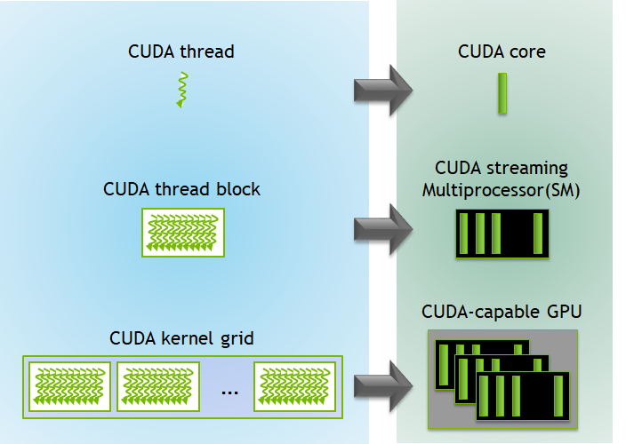
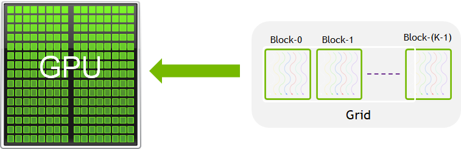

## GPU Programming 

In the previous section, we saw how we can get a significant speedup by parallelizing tasks across a few CPU cores. This is like turning a solo job into a small team effort. But what happens when the calculations within each task are incredibly demanding? For problems involving massive datasets, like complex simulations or training deep learning models, even a dozen CPU cores can struggle to finish in a reasonable time. This is where we need to move from a small team to a massive army of workers: GPUs.

## GPU Programming Concepts

GPUs, or Graphics Processing Units, are composed of thousands of lightweight processing cores that are optimized for handling multiple operations simultaneously. This parallel architecture makes them particularly effective for data-parallel problems, where the same operation is performed independently across large datasets such as matrix multiplications, vector operations, or image processing tasks.

Originally designed to accelerate the rendering of complex graphics and visual effects in computer games, GPUs are inherently well-suited for high-throughput computations involving large tensors and multidimensional arrays. Their architecture enables them to perform numerous arithmetic operations in parallel, which has made them increasingly valuable in scientific computing, deep learning, and simulations.

Even without explicit parallel programming, many modern libraries and frameworks (such as TensorFlow, PyTorch, and CuPy) can automatically leverage GPU acceleration to significantly improve performance. However, to fully exploit the computational power of GPUs, especially in high-performance computing (HPC) environments, explicit parallelization is often employed. 

### CPU vs GPU Architecture

The fundamental difference lies in their design philosophy. CPUs are optimized for low latency on sequential tasks, while GPUs are built for high throughput on parallel tasks.

- CPUs: Few powerful cores, better for sequential tasks.
- GPUs: Many lightweight cores, ideal for parallel workloads.


<p style="text-align: center;">Unlike CPU, that has to handle huge variety of tasks and control data flow in a complicated manner, GPUs dedicate more transistors to data operations. Credit: <a href="https://docs.nvidia.com/cuda/cuda-c-programming-guide/index.html">CUDA C Programming Guide</a></p>

## Comparing CPU and GPU Approaches

| Feature      | CPU (OpenMP/MPI)          | GPU (CUDA)                  |
|--------------|---------------------------|-----------------------------|
| Cores        | Few (2–64)                | Thousands (1024–10000+)     |
| Memory       | Shared / distributed      | Device-local (needs transfer)|
| Programming  | Easier to debug           | Requires more setup         |
| Performance  | Good for logic-heavy tasks| Excellent for large, data-parallel problems |


## Introduction to CUDA

In HPC systems, CUDA (Compute Unified Device Architecture), a parallel computing platform and programming model developed by NVIDIA is the most widely used platform for GPU programming. CUDA allows developers to write highly parallel code that runs directly on the GPU, providing fine-grained control over memory usage, thread management, and performance optimization. It allows developers to harness the power of NVIDIA GPUs for general-purpose computing, known as GPGPU (General-Purpose computing on Graphics Processing Units).

### A Brief History

- Introduced by NVIDIA in 2006, CUDA was the first platform to provide direct access to the GPU's virtual instruction set and parallel computational elements.
- Before CUDA, GPUs were primarily used for rendering graphics, and general-purpose computations required indirect use through graphics APIs like OpenGL or DirectX.
- CUDA revolutionized scientific computing, deep learning, and high-performance computing (HPC) by enabling massive parallelism and accelerating workloads previously limited to CPUs.

### How CUDA Works

CUDA allows developers to write C, C++, Fortran, and Python code that runs on the GPU.

- A CUDA program typically runs on both the CPU (host) and the GPU (device).
- Computational tasks (kernels) are written to execute in parallel across thousands of lightweight CUDA threads.
- These threads are organized hierarchically into:
  - Grids of Blocks
  - Blocks of Threads

Lets look at this hierarchy in detail in the section below

# CUDA Hierarchy

In this section, we’ll explore how **CUDA organizes threads** and how this maps to the **GPU hardware**.  

## 1. CUDA Program Execution 

A CUDA program runs in **two places**:

- **CPU (Host)**:  
  Handles setup — memory allocation, kernel launches, etc.
- **GPU (Device)**:  
  Runs the **kernels** (functions annotated with `__global__`) using thousands of lightweight threads in parallel.

## 2. Hierarchical Organization of Threads

CUDA uses a **hierarchical structure** to manage threads efficiently.  
There are **three main levels**:

### a) CUDA Thread

- The **smallest execution unit** in CUDA.
- Each thread runs the **same kernel code** but on **different data**  
  → This model is called **SIMT** (Single Instruction, Multiple Threads).
- Each thread has a **unique ID** (`threadIdx`) so it knows *which piece of data* to work on.

---

**Hardware Mapping: CUDA Thread → CUDA Core**

- A **CUDA core** is the **smallest compute unit** on the GPU.  
  Think of it like a **CPU core**, but **simpler and lighter**.

- Each CUDA core:
  - Executes one **thread’s instructions** at a time.
  - Is optimized for **massive parallelism** rather than single-thread speed.

- Unlike CPUs (which have a few very powerful cores),  
  GPUs have **hundreds or thousands of CUDA cores**,  
  enabling them to run *many threads simultaneously*.

---

### b) CUDA Thread Block

- Threads are grouped into **blocks**.
- A **block** can have up to thousands of threads (hardware limit, often 1024).
- Threads in the same block can:
  - Share **fast shared memory**.
  - Synchronize with `__syncthreads()`.

 **Hardware mapping:** A thread block is executed on a **Streaming Multiprocessor (SM)**.

#### Thread Indexing in a Block:
Each thread has coordinates (`threadIdx.x`, `threadIdx.y`, `threadIdx.z`).  
Within a 1D setup:
globalThreadID = blockIdx.x * blockDim.x + threadIdx.x

This formula lets every thread know its **global position** in the grid.

---

### c) CUDA Kernel Grid

- Blocks are grouped into a **grid**.
- A **grid** can be 1D, 2D, or 3D depending on your problem.
- The **grid** allows CUDA to scale to **millions of threads**.
- Threads in *different blocks* cannot use shared memory together,  
  but they can communicate via **global memory**.

---

**Hardware Mapping: CUDA Grid → Full GPU**

- A **Streaming Multiprocessor (SM)** is the **workhorse unit** of the GPU.  
  Each SM is a **cluster of CUDA cores** plus supporting hardware.

- Each SM contains:
  - **Many CUDA cores** (e.g., 64–128, depending on GPU generation).
  - **Registers** → very fast storage for threads.
  - **Shared memory** → a small, fast memory space for threads in the same block.
  - **Schedulers** → decide which threads run next.

- An SM is responsible for running **one or more thread blocks** at a time.
- Modern GPUs have **tens of SMs**, each with dozens of CUDA cores,  
  enabling massive parallelism across the grid.

---

## 3. GPU Hardware Mapping

- Each **Streaming Multiprocessor (SM)** runs **multiple blocks** at once.
- Each **CUDA core** executes **individual threads**.
- A GPU has **many SMs**, which is why it can run *thousands of threads simultaneously*.

**Mapping (image reference):**
- Single thread → CUDA core  
- Thread block → Streaming Multiprocessor (SM)  
- Grid → Whole GPU

---

## 4. Summary Table

| **Level**     | **Unit**        | **Purpose**                          | **ID Reference**                   | **Hardware Mapping**          |
| ------------- | --------------- | ------------------------------------ | ---------------------------------- | ----------------------------- |
| Thread        | 1 thread        | Smallest unit of computation         | `threadIdx`                        | CUDA Core                     |
| Thread Block  | Group of threads| Shares memory, synchronizes threads  | `blockIdx`, `threadIdx`            | Streaming Multiprocessor (SM) |
| Grid (Kernel) | Block of blocks | Scales to the entire dataset         | `gridDim`, `blockDim`, `threadIdx` | Full GPU                      |

We can visualise this using the diagrams given below: 



<p style="text-align: center;"><a href="https://developer.nvidia.com/blog/cuda-refresher-cuda-programming-model/">CUDA Kernel Execution</a></p>

<!-- ### Key Features

- **Massive parallelism** with thousands of concurrent threads
- **Unified memory architecture** for seamless CPU-GPU data access
- **Built-in libraries** for BLAS, FFT, random number generation, and more (e.g., cuBLAS, cuFFT, cuRAND)
- **Tooling support** including profilers, debuggers, and performance analyzers (e.g., Nsight, CUDA-GDB) -->

### A CUDA program includes:

- **Host code**: Runs on the CPU, manages memory, and launches kernels.
- **Device code (kernel)**: Runs on the GPU.
- **Memory management**: Host/device memory allocations and transfers.

### To execute any CUDA program, there are three main steps:

- Copy the input data from host memory to device memory, also known as host-to-device transfer.
- Load the GPU program and execute, caching data on-chip for performance.
- Copy the results from device memory to host memory, also called device-to-host transfer.

## CUDA Libraries in Python

When programming GPUs from Python, we can choose between different levels of abstraction. Some libraries hide most of the CUDA details, while others give us fine-grained control. This choice depends on whether you want quick prototyping, large-scale training, or custom GPU kernels.

### High-Level CUDA Libraries
These libraries handle most CUDA operations automatically. They are easiest to use when your goal is training models or working with arrays without writing GPU kernels.

- **PyTorch**: Deep learning framework with dynamic computation graphs; move data to GPU with `.to("cuda")`.  
- **TensorFlow**: Deep learning framework with built-in GPU acceleration; runs on GPU automatically if available.  
- **JAX**: NumPy-like library from Google; uses XLA to JIT-compile code for CPU, GPU (CUDA), and TPU backends.

### Mid-Level CUDA Libraries
These provide a familiar NumPy-like interface but allow more explicit GPU control when needed.

- **CuPy**: Drop-in replacement for NumPy arrays; runs operations on the GPU and also supports writing custom CUDA kernels.

### Low-Level CUDA Libraries
These libraries give you the most control. You can write your own GPU kernels and manage device memory directly.

- **Numba**: JIT compiler for Python; allows writing custom CUDA kernels using `@cuda.jit`.

---

## Implementing the libraries to use CUDA 

We will now implement vector addition for an input array of one million elements using two approaches: a high-level library (PyTorch) and a low-level library (Numba). These libraries were already installed during the Bura Setup stage of the environment configuration.

### Checking CUDA availability before running code

~~~
# File Name - cuda_check.py
# This script checks whether CUDA is available using Numba
# and prints the name of the detected GPU if present.

# Import Numba's CUDA module
from numba import cuda  

# Check if CUDA-capable GPU is available
if cuda.is_available():
    print("CUDA is available!")
    
    # Get information about the current GPU device
    print(f"Detected GPU: {cuda.get_current_device().name}")
else:
    print("CUDA is NOT available.")
~~~
{: .language-python}
~~~
CUDA is available!
Detected GPU: b'NVIDIA GeForce RTX 3060 Laptop GPU'
~~~
{: .output}
---

### Approach 1: Add vectors using the `numba` Python library 

~~~
# File Name - numba_cuda.py
# This script demonstrates vector addition on the GPU using Numba's CUDA JIT.
# 1. Define a CUDA kernel for element-wise vector addition.
# 2. Allocate and copy input arrays to the GPU.
# 3. Configure the kernel launch (blocks and threads).
# 4. Run the kernel on the GPU and measure execution time.
# 5. Copy results back to the host and verify correctness.

# Import Numba's CUDA module, NumPy for array operations and time to measure execution time
from numba import cuda   
import numpy as np        
import time              

# @cuda.jit is a decorator provided by Numba. 
# It tells Numba to compile the following function (add_vectors) into a CUDA kernel 
# that can be executed on the GPU. 
# This allows Python code to be transformed into low-level GPU code.
# Therefore @cuda.jit is used to define a CUDA kernel for vector addition
@cuda.jit
def add_vectors(a, b, c):
    # Compute absolute thread index within the entire grid
    i = cuda.grid(1)
    
    # Perform addition only if within bounds
    if i < a.size:
        c[i] = a[i] + b[i]

# Setup input arrays
N = 1000
a = np.arange(N, dtype=np.float32)
b = np.arange(N, dtype=np.float32)
c = np.zeros_like(a)

# Copy arrays to device
d_a = cuda.to_device(a)
d_b = cuda.to_device(b)
d_c = cuda.device_array_like(a)

# Configure the kernel
threads_per_block = 256  
# Typically, GPUs allow up to 1024 threads per block in 1D (depends on GPU architecture). 
# Using multiples of 32 is often optimal because of "warps" (groups of 32 threads scheduled together).

blocks_per_grid = (N + threads_per_block - 1) // threads_per_block  
# Ensure all elements are covered by rounding up.
# Grid size (total number of threads) = blocks_per_grid * threads_per_block.
# Hardware limitation: Max grid size depends on GPU (often in the range of 2^31-1 for 1D).

# Launch the kernel
start = time.time()
add_vectors[blocks_per_grid, threads_per_block](d_a, d_b, d_c)
cuda.synchronize()  # Wait for GPU to finish
gpu_time = time.time() - start

# Copy result back to host
d_c.copy_to_host(c)

# Verify results
print("First 5 results:", c[:5])
print("Time taken on GPU:", gpu_time, "seconds")
~~~
{: .language-python}
~~~
/home/alex/miniconda3/envs/interpython_hpc/lib/python3.13/site-packages/numba/cuda/dispatcher.py:536: NumbaPerformanceWarning: Grid size 4 will likely result in GPU under-utilization due to low occupancy.
  warn(NumbaPerformanceWarning(msg))
First 5 results: [0. 2. 4. 6. 8.]
Time taken on GPU: 0.10699796676635742 seconds
~~~
{: .output}

### Code Explanation

In the **Numba example**, we see how CUDA works at a low level:
- We first define a GPU kernel using `@cuda.jit`. This kernel runs on the GPU and performs vector addition element by element. 
- The code `@cuda.jit` is a decorator. A decorator in Python is essentially a function that modifies or extends the behavior of another function or class without changing its source code.  
- Basically it passes function `add_vectors` into the cuda.jit function which turns the python code into low level GPU code. 
- The function `cuda.grid(1)` gives each thread a unique index `i`. Each GPU thread computes one element of the result.  
- We must explicitly **copy data** from host (CPU) memory to device (GPU) memory with `cuda.to_device`.  
- We also configure how many **threads per block** and how many **blocks per grid** to use before launching the kernel.  
- Finally, we copy the results back from device to host memory.  

This approach is very close to how CUDA is programmed in C/C++. It teaches us about **threads, blocks, and memory transfers**, which are the fundamental ideas of CUDA programming as we saw in the CUDA heirarchy section.

> ## Python decorators
> It is entirely possible that even if you've been programming with Python for a long time now, you have never
> encountered [decorators](https://book.pythontips.com/en/latest/decorators.html) before. They may seem mysterious, however, the idea behind them is quite
> simple - they are _wrapper_ functions, that accept user-defined function as a parameter. This is possible because in Python, everything is an _object_, including
> functions, so you can assign them to a variable, pass as a parameter or return from another function. Common application for decorators is logging or performance measurement, or,
> as we saw above, a conversion to a format that can be executed on a GPU.
{: .callout}

### Approach 2: Add vectors using Torch

~~~
# File Name - torch_cuda.py
# This script demonstrates performing vector addition on a GPU using PyTorch.
# It highlights how PyTorch can leverage CUDA-enabled GPUs to accelerate 
# array operations compared to CPU execution.

# Import PyTorch for GPU-accelerated tensor operations and time for measuring execution time
import torch        
import time         

# Define the size of the vectors
N = 1_000_000

# Create two input tensors 'a' and 'b' directly on the GPU 
# (dtype=float32 for efficiency, device="cuda" ensures they are allocated on GPU)
a = torch.arange(N, dtype=torch.float32, device="cuda")
b = torch.arange(N, dtype=torch.float32, device="cuda")

# Record the start time before performing the vector addition
start = time.time()

# Perform element-wise vector addition on the GPU
c = a + b

# Synchronize with the GPU to ensure that all operations have finished
# (without this, the recorded time may not include the actual GPU computation)
torch.cuda.synchronize()

# Calculate the total elapsed GPU execution time
gpu_time = time.time() - start

# Print the first 5 results of the output vector after moving them back to CPU
# (useful to verify correctness of computation)
print("First 5 results:", c[:5].cpu().numpy())

# Print the total time taken for the GPU computation
print("Time taken on GPU (PyTorch):", gpu_time, "seconds")

~~~
{: .language-python}
~~~
First 5 results: [0. 2. 4. 6. 8.]
Time taken on GPU (PyTorch): 0.03913474082946777 seconds
~~~
{: .output}

### Code Explanation

In the **PyTorch example**, the same operation looks much simpler:
- We create tensors directly on the GPU by specifying `device="cuda"`.  
- Adding them with `c = a + b` automatically runs the computation on the GPU.  
- We call `torch.cuda.synchronize()` to make sure the GPU finishes before timing.  
- If we want to print results, we copy them back to the CPU with `.cpu().numpy()`.  

Here, PyTorch **hides all CUDA details**. We don’t need to worry about threads, blocks, or explicit memory transfers — the library manages them for us.  
## Slurm Script to execute the code 

The following script can be used to submit a GPU-accelerated Python job (`numba_cuda_test.py`) using Slurm:

```bash
#!/bin/bash
#SBATCH --job-name=cuda_libraries # Name of the Job 
#SBATCH --output=cuda_l_%j.out # Name of the output file for the Job 
#SBATCH --error=cuda_l_%j.err # Name of the error file for the Job
#SBATCH --partition=gpu # Request the appropriate partition for the job 
#SBATCH --nodes=1 # Request the appropriate number of computing nodes required for the job
#SBATCH --cpus-per-task=4 # Request the appropriate number of cpus per computing node required for the job
#SBATCH --mem=16G # This specifies the amount of memory which will be allocated for the job 
#SBATCH --gpus-per-node=1 # Request the appropriate number of gpus per computing node required for the job
#SBATCH --time=00:10:00 # This specifies the maximum amount of time that the job will run for

# Load required modules (This is a sanity check in case jobs are not running as required)
module list

# Activate your virtual environment (We have already activated this in terminal so this again a sanity check)
source interpython/bin/activate 

# Run the Python example scripts sequentially
python numba_cuda.py 
python torch_cuda.py 
```

> ## Exercise: Vector Multiplication on the GPU
> In the previous examples, we added two vectors together using **Numba** and **PyTorch**.  
> Now, modify both codes so that they **multiply** two vectors element by element instead of adding them.  
>
>  - For **Numba**: change the CUDA kernel so that each thread multiplies elements instead of adding them.  
>  - For **PyTorch**: replace the addition operation with multiplication.  
>
> Try running your code and compare the results.
> > ## Solution
> >
> > **Numba solution:**
> > ~~~python
> > # File Name - numba_multiplication.py
> > # This script demonstrates element-wise multiplication of two vectors using Numba with CUDA.
> > # It highlights how GPU kernels can be written in Python using Numba’s @cuda.jit decorator,
> > # and how memory needs to be managed explicitly between host (CPU) and device (GPU).
> > 
> > # Import Numba’s CUDA module to write GPU kernels and NumPy for array creation and manipulation
> > from numba import cuda   
> > import numpy as np   
> > 
> > # Define a CUDA kernel function for element-wise vector multiplication
> > @cuda.jit
> > def multiply_vectors(a, b, c):
> >     # Calculate the unique thread index within the grid
> >     i = cuda.grid(1)
> >    
> >     # Ensure the thread index does not exceed the array size
> >     if i < a.size:
> >         c[i] = a[i] * b[i]  # Perform multiplication and store the result
> > 
> > # Define the size of the vectors
> > N = 10
> > 
> > # Create input arrays on the host (CPU)
> > a = np.arange(N, dtype=np.float32)   # Vector [0, 1, 2, ..., 9]
> > b = np.arange(N, dtype=np.float32)   # Vector [0, 1, 2, ..., 9]
> > 
> > # Create an output array initialized with zeros on the host
> > c = np.zeros_like(a)
> > 
> > # Copy input arrays from host (CPU) to device (GPU)
> > d_a = cuda.to_device(a)
> > d_b = cuda.to_device(b)
> > 
> > # Allocate memory on the device for the output array
> > d_c = cuda.device_array_like(a)
> > 
> > # Define GPU execution configuration
> > threads_per_block = 256
> > blocks_per_grid = (N + threads_per_block - 1) // threads_per_block  # Ceiling division
> > 
> > # Launch the kernel with the specified grid and block dimensions
> > multiply_vectors[blocks_per_grid, threads_per_block](d_a, d_b, d_c)
> > 
> > # Copy the result from device (GPU) back to host (CPU)
> > d_c.copy_to_host(c)
> > 
> > # Print the result
> > print("Result (Numba):", c)
> > ~~~
> > {: .language-python}
> >
> > ~~~
> > /home/alex/miniconda3/envs/interpython_hpc/lib/python3.13/site-packages/numba/cuda/dispatcher.py:536: NumbaPerformanceWarning: Grid size 1 will likely result in GPU under-utilization due to low occupancy.
> >   warn(NumbaPerformanceWarning(msg))
> > Result (Numba): [ 0.  1.  4.  9. 16. 25. 36. 49. 64. 81.]
> > ~~~
> > {: .output}
> > 
> > **PyTorch solution:**
> > ~~~python
> > # File Name - torch_multiplication.py
> > # This script demonstrates element-wise multiplication of two vectors using PyTorch on a GPU.
> > # It shows how to create tensors directly on the GPU, perform the multiplication operation,
> > # and then transfer the result back to the CPU for display.
> > 
> > # Import PyTorch for tensor operations
> > import torch
> >
> > 
> > # Define the size of the vectors
> > N = 10
> > 
> > # Create a vector of values [0, 1, 2, ..., N-1] stored on the GPU
> > a = torch.arange(N, dtype=torch.float32, device="cuda")
> > 
> > # Create another vector of values [0, 1, 2, ..., N-1] stored on the GPU
> > b = torch.arange(N, dtype=torch.float32, device="cuda")
> > 
> > # Perform element-wise multiplication directly on the GPU
> > c = a * b
> > 
> > # Move the result back to the CPU and convert it to a NumPy array for display
> > print("Result (PyTorch):", c.cpu().numpy())
> > ~~~
> > {: .language-python}
> >
> > ~~~
> > Result (PyTorch): [ 0.  1.  4.  9. 16. 25. 36. 49. 64. 81.]
> > ~~~
> > {: .output}
> > 
> > Both codes now perform **element-wise multiplication** instead of addition.
> {: .solution}
>
{: .challenge}

> ## References:
> - [Numba-CUDA Docs](https://nvidia.github.io/numba-cuda/)
> - [CuPy Documentation](https://docs.cupy.dev/)
> - [NVIDIA CUDA Samples](https://github.com/NVIDIA/cuda-samples)
{: .checklist}

## Summary

- Serial code is simple but doesn’t scale well.
- Use OpenMP and MPI for parallelism on CPUs.
- Use CUDA (or high-level wrappers like Numba/CuPy) for GPU programming.
- Always profile your code to understand performance.
- Choose your tool based on problem size, complexity, and hardware.

---



<!-- > ## Exercise: 
> Show which parts of the code execute on GPU vs CPU (host vs device). Read about concepts like memory copy and kernel launch.
{: .challenge} -->


