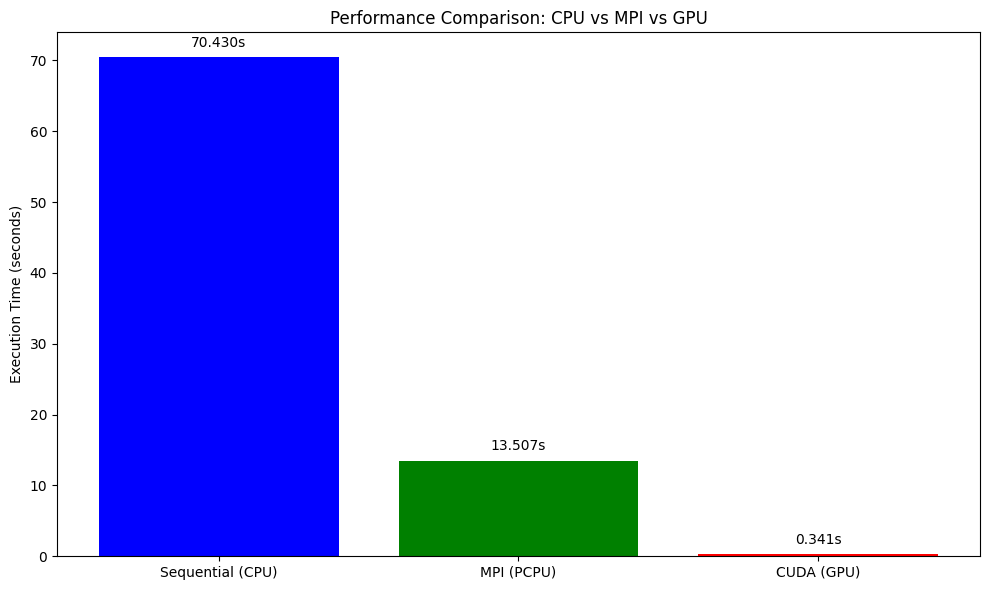

- Resource optimization (+practical session: running CPU and GPU code examples)

# Resource Optimization

## Learning Objectives

By the end of this lesson, you will be able to:


## Understanding Resource Requirements

Different computational tasks have varying resource requirements. Understanding these patterns is crucial for efficient HPC usage.

### Types of Workloads

**CPU-bound workloads**: Tasks that primarily use computational power
- Mathematical calculations, simulations, data processing
- Benefit from more CPU cores and higher clock speeds

**Memory-bound workloads**: Tasks limited by memory access speed
- Large dataset processing, in-memory databases
- Require sufficient RAM and fast memory access

**I/O-bound workloads**: Tasks limited by disk or network operations
- File processing, database queries, data transfer
- Benefit from fast storage and network connections

**GPU-accelerated workloads**: Tasks that can utilize parallel processing
- Machine learning, scientific simulations, image processing
- Require appropriate GPU resources and memory

### Resource Profiling

Before optimizing, you need to understand your program's resource usage:

```bash
# Monitor CPU and memory usage
htop

# Time a program and get resource statistics  
/usr/bin/time -v ./your_program

# Monitor GPU usage (if available)
nvidia-smi

# Watch GPU usage continuously
watch -n 1 nvidia-smi
```

---
## Types of Jobs and Resources

| Job Type   | SLURM Partition | Key SLURM Options              | Example Use Case            |
|------------|------------------|-------------------------------|-----------------------------|
| Serial     | `serial`         | `--partition`, no MPI         | Single-thread tensor calc   |
| Parallel   | `defaultq`       | `-N`, `-n`, `mpirun`          | MPI simulation              |
| GPU        | `gpu`            | `--gpus`, `--cpus-per-task`   | Deep learning training      |

---

## Example

For understanding how we can utilise different resources available on the HPC for the same computational task, we take the example of a python code which calculates the Gravitational Deflection Angle defined in the following way: 

### Deflection Angle Formula

For light passing near a massive object, the deflection angle (α) in the weak-field approximation is given by:

```
α = 4GM / (c²b)
```

Where:

- G = Gravitational constant (6.67430 × 10⁻¹¹ m³ kg⁻¹ s⁻²)
- M = Mass of the lensing object (in kilograms)
- c = Speed of light (299792458 m/s)
- b = Impact parameter (the closest approach distance of the light ray to the mass, in meters)

## Computational Task Description

Compute the deflection angle over a grid of:

- Mass values: From 1 to 1000 solar masses (10³⁰ to 10³³ kg)
- Impact parameters: From 10⁹ to 10¹² meters

Generate a 2D array where each entry corresponds to the deflection angle for a specific pair of mass and impact parameter. Now we will look at how we will implement this for the different resources available on the HPC. 

<!-------------------------------------------- Section-1 ------------------------------------------------------------------>
## Sequential Job Optimization

Sequential jobs run on a single CPU core and are suitable for tasks that cannot be parallelized.

### Sequential Job Script Explained

```bash
#!/bin/bash
#SBATCH -J jobname                    # Job name for identification
#SBATCH -o outfile.%J                 # Standard output file (%J = job ID)
#SBATCH -e errorfile.%J               # Standard error file (%J = job ID)
#SBATCH --partition=serial            # Use serial queue for single-core jobs
./[programme executable name]          # Execute your program
```

**Script breakdown:**
- `#!/bin/bash`: Specifies bash shell for script execution
- `#SBATCH -J jobname`: Sets a descriptive job name for easy identification in queue
- `#SBATCH -o outfile.%J`: Redirects standard output to a file with job ID
- `#SBATCH -e errorfile.%J`: Redirects error messages to separate file
- `#SBATCH --partition=serial`: Specifies the queue/partition for sequential jobs

### Example: Gravitational Deflection Angle Sequential CPU
```python
import numpy as np
import time
import matplotlib.pyplot as plt
import os
import matplotlib.colors as colors

# Constants
G = 6.67430e-11
c = 299792458
M_sun = 1.98847e30

# Parameter grid
mass_grid = np.linspace(1, 1000, 10000)  # Solar masses
impact_grid = np.linspace(1e9, 1e12, 10000)  # meters

result = np.zeros((len(mass_grid), len(impact_grid)))

# Timing
start = time.time()

# Sequential computation
for i, M in enumerate(mass_grid):
    for j, b in enumerate(impact_grid):
        result[i, j] = (4 * G * M * M_sun) / (c**2 * b)

end = time.time()

print(f"CPU Sequential time: {end - start:.3f} seconds")

result = np.save("result_cpu.npy", result)
mass_grid = np.save("mass_grid_cpu.npy", mass_grid)
impact_grid = np.save("impact_grid_cpu.npy", impact_grid)

# Load data
result = np.load("result_cpu.npy")
mass_grid = np.load("mass_grid_cpu.npy")
impact_grid = np.load("impact_grid_cpu.npy")

# Create meshgrid
M, B = np.meshgrid(mass_grid / 1.989e30, impact_grid / 1e9, indexing='ij')

# Create output directory
os.makedirs("plots", exist_ok=True)

plt.figure(figsize=(8,6))
pcm = plt.pcolormesh(B, M, result,
                      norm=colors.LogNorm(vmin=result[result > 0].min(), vmax=result.max()),
                      shading='auto', cmap='plasma')

plt.colorbar(pcm, label='Deflection Angle (radians, log scale)')
plt.xlabel('Impact Parameter (Gm)')
plt.ylabel('Mass (Solar Masses)')
plt.title('Gravitational Deflection Angle - CPU')

plt.tight_layout()
plt.savefig("plots/deflection_angle_cpu.png", dpi=300)
plt.close()

print("CPU plot saved in 'plots/deflection_angle_cpu.png'")
```

<!-- ```c
// matrix_mult_sequential.c
#include <stdio.h>
#include <stdlib.h>
#include <time.h>

int main() {
    int n = 1000;  // Matrix size
    double **A, **B, **C;
    
    // Allocate memory for matrices
    A = (double**)malloc(n * sizeof(double*));
    B = (double**)malloc(n * sizeof(double*));
    C = (double**)malloc(n * sizeof(double*));
    
    for(int i = 0; i < n; i++) {
        A[i] = (double*)malloc(n * sizeof(double));
        B[i] = (double*)malloc(n * sizeof(double));
        C[i] = (double*)malloc(n * sizeof(double));
    }
    
    // Initialize matrices
    for(int i = 0; i < n; i++) {
        for(int j = 0; j < n; j++) {
            A[i][j] = (double)rand() / RAND_MAX;
            B[i][j] = (double)rand() / RAND_MAX;
            C[i][j] = 0.0;
        }
    }
    
    clock_t start = clock();
    
    // Matrix multiplication
    for(int i = 0; i < n; i++) {
        for(int j = 0; j < n; j++) {
            for(int k = 0; k < n; k++) {
                C[i][j] += A[i][k] * B[k][j];
            }
        }
    }
    
    clock_t end = clock();
    double cpu_time = ((double)(end - start)) / CLOCKS_PER_SEC;
    
    printf("Sequential matrix multiplication completed in %f seconds\n", cpu_time);
    
    // Clean up memory
    for(int i = 0; i < n; i++) {
        free(A[i]); free(B[i]); free(C[i]);
    }
    free(A); free(B); free(C);
    
    return 0;
}
``` -->

### Sequential Job Script for the Above Example

<!-- ```bash
#!/bin/bash
#SBATCH -J matrix_sequential
#SBATCH -o matrix_seq_%J.out
#SBATCH -e matrix_seq_%J.err
#SBATCH --partition=serial
#SBATCH --time=00:30:00              # Set time limit
#SBATCH --mem=4G                     # Request 4GB memory

echo "Starting sequential matrix multiplication..."
echo "Job ID: $SLURM_JOB_ID"
echo "Node: $SLURM_NODELIST"

./matrix_mult_sequential

echo "Job completed at $(date)"
``` -->

```bash
#!/bin/bash
#SBATCH --job-name=HPC_WS_SCPU # Provide a name for the job 
#SBATCH --output=HPC_WS_SCPU_%j.out # Request the output file along with the job number
#SBATCH --error=HPC_WS_SCPU_%j.err # Request the error file along with the job number
#SBATCH --partition=dwfaultq 
#SBATCH --nodes=1 # Request one CPU node
#SBATCH --ntasks=1 # Request 1 core from the CPU node
#SBATCH --time=-01:00:00 # Set time limit for the job
#SBATCH --mem=16G #Request 16GB memory 

# Load required modules
module purge # Remove the list of pre loaded modules
module load Python/3.9.1
module list

# Create a python virtual environment 
python3 -m venv name_of_your_venv

# Activate your Python environment
source name_of_your_venv/bin/activate

echo "Starting Gravitational Lensing Deflection calculation of Sequential CPU..."
echo "Job ID: $SLURM_JOB_ID"
echo "Node: $SLURM_NODELIST"

# Run the Python script (with logging)
python Gravitational_Deflection_Angle_SCPU.py

echo "Job completed at $(date)"
```

> ## Exercise: Profile Your Code
> Compile and run the sequential matrix multiplication. Use `time` and `htop` to monitor resource usage. Identify whether it's CPU-bound or memory-bound
{: .challenge}

<!-------------------------------------------- Section-2 ------------------------------------------------------------------>
## Parallel Job Optimization

Parallel jobs can utilize multiple CPU cores across one or more nodes to accelerate computation.

### Parallel Job Script Explained

```bash
#!/bin/bash
#SBATCH -J jobname                    # Job name
#SBATCH -o outfile.%J                 # Output file
#SBATCH -e errorfile.%J               # Error file
#SBATCH --partition=defaultq          # Parallel job queue
#SBATCH -N 2                          # Number of compute nodes
#SBATCH -n 24                         # Total number of CPU cores per node
mpirun -np 48 ./mpi_program           # Run with 48 MPI processes (2 nodes × 24 cores)
```

**Key parameters:**
- `#SBATCH -N 2`: Requests 2 compute nodes
- `#SBATCH -n 24`: Specifies 24 CPU cores per node
- `mpirun -np 48`: Launches 48 MPI processes total (2 × 24)

### Example: Gravitational Deflection Angle Parallel CPU

```python
from mpi4py import MPI
import numpy as np
import time
import os 
import matplotlib.pyplot as plt
import matplotlib.colors as colors

# MPI setup
comm = MPI.COMM_WORLD
rank = comm.Get_rank()
size = comm.Get_size()

# Constants
G = 6.67430e-11
c = 299792458
M_sun = 1.98847e30

# Parameter grid (same on all ranks)
mass_grid = np.linspace(1, 1000, 10000)  # Solar masses
impact_grid = np.linspace(1e9, 1e12, 10000)  # meters

# Distribute mass grid among ranks
chunk_size = len(mass_grid) // size
start_idx = rank * chunk_size
end_idx = (rank + 1) * chunk_size if rank != size - 1 else len(mass_grid)

local_mass = mass_grid[start_idx:end_idx]
local_result = np.zeros((len(local_mass), len(impact_grid)))

# Timing
local_start = time.time()

# Compute local chunk
for i, M in enumerate(local_mass):
    for j, b in enumerate(impact_grid):
        local_result[i, j] = (4 * G * M * M_sun) / (c**2 * b)

local_end = time.time()
print(f"Rank {rank} local time: {local_end - local_start:.3f} seconds")

# Gather results
result = None
if rank == 0:
    result = np.zeros((len(mass_grid), len(impact_grid)))

comm.Gather(local_result, result, root=0)

if rank == 0:
    total_time = local_end - local_start
    print(f"MPI total time (wall time): {total_time:.3f} seconds")
    result = np.save("result_mpi.npy", result)
    mass_grid = np.save("mass_grid_mpi.npy", mass_grid)
    impact_grid = np.save("impact_grid_mpi.npy", impact_grid)

# Load data
result = np.load("result_mpi.npy")
mass_grid = np.load("mass_grid_mpi.npy")
impact_grid = np.load("impact_grid_mpi.npy")

# Create meshgrid
M, B = np.meshgrid(mass_grid / 1.989e30, impact_grid / 1e9, indexing='ij')

# Create output directory
os.makedirs("plots", exist_ok=True)

plt.figure(figsize=(8,6))
pcm = plt.pcolormesh(B, M, result,
                      norm=colors.LogNorm(vmin=result[result > 0].min(), vmax=result.max()),
                      shading='auto', cmap='plasma')

plt.colorbar(pcm, label='Deflection Angle (radians, log scale)')
plt.xlabel('Impact Parameter (Gm)')
plt.ylabel('Mass (Solar Masses)')
plt.title('Gravitational Deflection Angle - MPI')

plt.tight_layout()
plt.savefig("plots/deflection_angle_mpi.png", dpi=300)
plt.close()

print("MPI plot saved in 'plots/deflection_angle_mpi.png'")
```
<!-- ```c
// matrix_mult_openmp.c
#include <stdio.h>
#include <stdlib.h>
#include <omp.h>

int main() {
    int n = 1000;
    double **A, **B, **C;
    
    // Allocate memory (same as sequential version)
    A = (double**)malloc(n * sizeof(double*));
    B = (double**)malloc(n * sizeof(double*));
    C = (double**)malloc(n * sizeof(double*));
    
    for(int i = 0; i < n; i++) {
        A[i] = (double*)malloc(n * sizeof(double));
        B[i] = (double*)malloc(n * sizeof(double));
        C[i] = (double*)malloc(n * sizeof(double));
    }
    
    // Initialize matrices
    #pragma omp parallel for
    for(int i = 0; i < n; i++) {
        for(int j = 0; j < n; j++) {
            A[i][j] = (double)rand() / RAND_MAX;
            B[i][j] = (double)rand() / RAND_MAX;
            C[i][j] = 0.0;
        }
    }
    
    double start_time = omp_get_wtime();
    
    // Parallel matrix multiplication
    #pragma omp parallel for
    for(int i = 0; i < n; i++) {
        for(int j = 0; j < n; j++) {
            for(int k = 0; k < n; k++) {
                C[i][j] += A[i][k] * B[k][j];
            }
        }
    }
    
    double end_time = omp_get_wtime();
    
    printf("OpenMP matrix multiplication completed in %f seconds\n", end_time - start_time);
    printf("Number of threads used: %d\n", omp_get_max_threads());
    
    // Clean up memory
    for(int i = 0; i < n; i++) {
        free(A[i]); free(B[i]); free(C[i]);
    }
    free(A); free(B); free(C);
    
    return 0;
} -->
<!-- ``` -->

### Optimized Parallel Job Script

<!-- ```bash
#!/bin/bash
#SBATCH -J matrix_openmp
#SBATCH -o matrix_omp_%J.out
#SBATCH -e matrix_omp_%J.err
#SBATCH --partition=defaultq
#SBATCH -N 1                         # Single node for shared memory
#SBATCH --ntasks-per-node=1          # One task per node
#SBATCH --cpus-per-task=24           # 24 CPU cores for OpenMP
#SBATCH --time=00:15:00
#SBATCH --mem=8G

# Set number of OpenMP threads
export OMP_NUM_THREADS=$SLURM_CPUS_PER_TASK

echo "Starting OpenMP matrix multiplication..."
echo "Job ID: $SLURM_JOB_ID"
echo "Node: $SLURM_NODELIST"
echo "Number of OpenMP threads: $OMP_NUM_THREADS"

./matrix_mult_openmp

echo "Job completed at $(date)"
``` -->

```bash
#!/bin/bash
#SBATCH --job-name=HPC_WS_PCPU # Provide a name for the job 
#SBATCH --output=HPC_WS_PCPU_%j.out # Request the output file along with the job number
#SBATCH --error=HPC_WS_PCPU_%j.err # Request the error file along with the job number
#SBATCH --partition=defaultq 
#SBATCH --nodes=2 # Request two CPU nodes
#SBATCH --ntasks=4 # Request 2 cores from each CPU node
#SBATCH --time=-01:00:00 # Set time limit for the job
#SBATCH --mem=16G #Request 16GB memory 

# Load required modules
module purge # Remove the list of pre loaded modules
module load Python/3.9.1
module load openmpi4/4.1.6
module list # List the modules

# Create a python virtual environment 
python3 -m venv name_of_your_venv

# Activate your Python environment
source name_of_your_venv/bin/activate

echo "Starting Gravitational Lensing Deflection calculation of Sequential CPU..."
echo "Job ID: $SLURM_JOB_ID"
echo "Node: $SLURM_NODELIST"

# Run the Python script with MPI (with logging)
mpirun -np 4 python Gravitational_Lensing_PCPU.py

echo "Job completed at $(date)"
```

> ## Exercise: Optimize Parallel Performance
> Compile the OpenMP version with different thread counts. Submit jobs with varying `--cpus-per-task` values. Plot performance vs. thread count
{: .challenge}

<!-------------------------------------------- Section-3 ------------------------------------------------------------------>
## GPU Job Optimization

GPU jobs leverage graphics processing units for massively parallel computations.

### GPU Job Script Explained

```bash
#!/bin/bash
#SBATCH --nodes=1                     # Single node (GPUs are node-local)
#SBATCH --ntasks-per-node=1           # One task per node
#SBATCH --cpus-per-task=4             # CPU cores to support GPU
#SBATCH -o output-%J.out              # Output file with job ID
#SBATCH -e error-%J.err               # Error file with job ID
#SBATCH --partition=gpu               # GPU-enabled partition
#SBATCH --mem 32G                     # Memory allocation
#SBATCH --gpus-per-node=1             # Number of GPUs requested
./[programme executable name]          # GPU program execution
```

**GPU-specific parameters:**
- `--partition=gpu`: Specifies GPU-enabled compute nodes
- `--gpus-per-node=1`: Requests one GPU per node
- `--mem 32G`: Allocates sufficient memory for GPU operations
- `--cpus-per-task=4`: Provides CPU cores to feed data to GPU

### Example: CUDA Implementation

```python
import numpy as np
from numba import cuda
import time
import matplotlib.pyplot as plt
import os
import matplotlib.colors as colors


# Constants
G = 6.67430e-11
c = 299792458

# Parameter grid
mass_grid = np.linspace(1e30, 1e33, 10000)
impact_grid = np.linspace(1e9, 1e12, 10000)

mass_grid_device = cuda.to_device(mass_grid)
impact_grid_device = cuda.to_device(impact_grid)
result_device = cuda.device_array((len(mass_grid), len(impact_grid)))

# CUDA kernel
@cuda.jit
def compute_deflection(mass_array, impact_array, result):
    i, j = cuda.grid(2)
    if i < mass_array.size and j < impact_array.size:
        M = mass_array[i]
        b = impact_array[j]
        result[i, j] = (4 * G * M) / (c**2 * b)

# Setup thread/block dimensions
threadsperblock = (16, 16)
blockspergrid_x = (mass_grid.size + threadsperblock[0] - 1) // threadsperblock[0]
blockspergrid_y = (impact_grid.size + threadsperblock[1] - 1) // threadsperblock[1]
blockspergrid = (blockspergrid_x, blockspergrid_y)

# Run the kernel
start = time.time()
compute_deflection[blockspergrid, threadsperblock](mass_grid_device, impact_grid_device, result_device)
cuda.synchronize()
end = time.time()

result = result_device.copy_to_host()

print(f"CUDA time: {end - start:.3f} seconds")

# Save the result and grids
np.save("result_cuda.npy", result)
np.save("mass_grid_cuda.npy", mass_grid)
np.save("impact_grid_cuda.npy", impact_grid)

print("Result and grids saved as .npy files.")

# Load data
result = np.load("result_cuda.npy")
mass_grid = np.load("mass_grid_cuda.npy")
impact_grid = np.load("impact_grid_cuda.npy")

# Create meshgrid
M, B = np.meshgrid(mass_grid / 1.989e30, impact_grid / 1e9, indexing='ij')

# Create output directory
os.makedirs("plots", exist_ok=True)

plt.figure(figsize=(8,6))
pcm = plt.pcolormesh(B, M, result,
                      norm=colors.LogNorm(vmin=result[result > 0].min(), vmax=result.max()),
                      shading='auto', cmap='plasma')

plt.colorbar(pcm, label='Deflection Angle (radians, log scale)')
plt.xlabel('Impact Parameter (Gm)')
plt.ylabel('Mass (Solar Masses)')
plt.title('Gravitational Deflection Angle - CUDA')

plt.tight_layout()
plt.savefig("plots/deflection_angle_cuda.png", dpi=300)
plt.close()

print("CUDA plot saved in 'plots/deflection_angle_cuda.png'")
```

> ## Exercise: GPU vs CPU Comparison
> Run the tensor operations script on both CPU and GPU. Compare execution times and memory usage. Calculate the speedup factor
{: .challenge}

### Optimized GPU Job Script

```bash
#!/bin/bash
#SBATCH --job-name=HPC_WS_GPU  # Provide a name for the job 
#SBATCH --output=HPC_WS_GPU_%j.out
#SBATCH --error=HPC_WS_GPU_%j.err
#SBATCH --partition=gpu
#SBATCH --nodes=1
#SBATCH --ntasks-per-node=1
#SBATCH --cpus-per-task=4 # Number of CPUs for data preparation 
#SBATCH --mem=32G # Memmory allocation
#SBATCH --gpus-per-node=1
#SBATCH --time=06:00:00

# --------- Load Environment ---------
module load Python/3.12.8
module load cuda/12.6.3
module list

# Activate virtualenv
source npe/bin/activate

# Confirm Python and GPU availability
python -c "
import torch
print('CUDA Available:', torch.cuda.is_available())
if torch.cuda.is_available():
    print('Device:', torch.cuda.get_device_name(0))
"

# --------- Run the Python Script ---------
python Gravitational_Lensing_GPU.py
```

<!-------------------------------------------- Section-4 ------------------------------------------------------------------>

## Resource Monitoring and Performance Analysis

### Monitoring Job Performance

```bash
#!/bin/bash

#SBATCH --partition=gpu
#SBATCH --gpus=1
#SBATCH --job-name=ResourceMonitor
#SBATCH --output=ResourceMonitor_%j.out
#SBATCH --time=00:10:00  # 10 minutes max (5 for monitoring + buffer)

# --------- Configuration ---------
LOG_FILE="resource_monitor.log"
INTERVAL=30    # Interval between logs in seconds
DURATION=60   # Total duration in seconds (5 minutes)
ITERATIONS=$((DURATION / INTERVAL))

# --------- Start Monitoring ---------
echo "Starting Resource Monitoring for $DURATION seconds (~$((DURATION/60)) minutes)..."
echo "Logging to: $LOG_FILE"
echo "------ Monitoring Started at $(date) ------" >> "$LOG_FILE"

# --------- System Info Check ---------
echo "==== System Info Check ====" | tee -a "$LOG_FILE"
echo "Hostname: $(hostname)" | tee -a "$LOG_FILE"

# Check NVIDIA driver and GPU presence
if command -v nvidia-smi &> /dev/null; then
    echo "✅ nvidia-smi is available." | tee -a "$LOG_FILE"
    if nvidia-smi &>> "$LOG_FILE"; then
        echo "✅ GPU detected and driver is working." | tee -a "$LOG_FILE"
    else
        echo "⚠️ NVIDIA-SMI failed. Check GPU node or driver issues." | tee -a "$LOG_FILE"
    fi
else
    echo "❌ nvidia-smi is not installed." | tee -a "$LOG_FILE"
fi

echo "Checking for NVIDIA GPU presence on PCI bus..." | tee -a "$LOG_FILE"
if lspci | grep -i nvidia &>> "$LOG_FILE"; then
    echo "✅ NVIDIA GPU found on PCI bus." | tee -a "$LOG_FILE"
else
    echo "❌ No NVIDIA GPU detected on this node." | tee -a "$LOG_FILE"
fi

echo "" | tee -a "$LOG_FILE"

# --------- Trap CTRL+C for Clean Exit ---------
trap "echo 'Stopping monitoring...'; echo '------ Monitoring Ended at $(date) ------' >> \"$LOG_FILE\"; exit" SIGINT SIGTERM

# --------- Monitoring Loop ---------
for ((i=1; i<=ITERATIONS; i++)); do
    echo "========================== $(date) ==========================" >> "$LOG_FILE"

    # GPU usage monitoring
    echo "--- GPU Usage (nvidia-smi) ---" >> "$LOG_FILE"
    nvidia-smi 2>&1 | grep -v "libnvidia-ml.so" >> "$LOG_FILE"
    echo "" >> "$LOG_FILE"

    # CPU and Memory monitoring
    echo "--- CPU and Memory Usage (top) ---" >> "$LOG_FILE"
    top -b -n 1 | head -20 >> "$LOG_FILE"
    echo "" >> "$LOG_FILE"

    sleep $INTERVAL
done

echo "------ Monitoring Ended at $(date) ------" >> "$LOG_FILE"
echo "✅ Resource monitoring completed."
```


# Understanding Outputs - `top` CPU and Memory Monitoring

## Example Output:

```
--- CPU and Memory Usage (top) ---
top - 17:53:49 up 175 days,  9:41,  0 users,  load average: 1.01, 1.06, 1.08
Tasks: 765 total,   1 running, 764 sleeping,   0 stopped,   0 zombie
%Cpu(s):  2.2 us,  0.1 sy,  0.0 ni, 97.7 id,  0.0 wa,  0.0 hi,  0.0 si,  0.0 st
MiB Mem : 515188.2 total, 482815.2 free,  17501.5 used,  14871.5 buff/cache
MiB Swap:   4096.0 total,   4072.2 free,     23.8 used. 493261.3 avail Mem
```

## Explanation:

### Header Line - System Uptime and Load Average

```
top - 17:53:49 up 175 days,  9:41,  0 users,  load average: 1.01, 1.06, 1.08
```

* **17:53:49** - Current time.
* **up 175 days, 9:41** - How long the system has been running.
* **0 users** - Number of users logged in.
* **load average** - System load over 1, 5, and 15 minutes.

  * A load of 1.00 means one CPU core is fully utilized.

### Task Summary

```
Tasks: 765 total,   1 running, 764 sleeping,   0 stopped,   0 zombie
```

* **765 total** - Total processes.
* **1 running** - Actively running.
* **764 sleeping** - Waiting for input or tasks.
* **0 stopped** - Stopped processes.
* **0 zombie** - Zombie processes (defunct).

### CPU Usage

```
%Cpu(s):  2.2 us,  0.1 sy,  0.0 ni, 97.7 id,  0.0 wa,  0.0 hi,  0.0 si,  0.0 st
```

| Field  | Meaning                            |
| ------ | ---------------------------------- |
| **us** | User CPU time - 2.2%               |
| **sy** | System (kernel) time - 0.1%        |
| **ni** | Nice (priority) - 0.0%             |
| **id** | Idle - 97.7%                       |
| **wa** | Waiting for I/O - 0.0%             |
| **hi** | Hardware interrupts - 0.0%         |
| **si** | Software interrupts - 0.0%         |
| **st** | Steal time (virtualization) - 0.0% |

### Memory Usage

```
MiB Mem : 515188.2 total, 482815.2 free,  17501.5 used,  14871.5 buff/cache
```

| Field          | Meaning                              |
| -------------- | ------------------------------------ |
| **total**      | Total RAM (515188.2 MiB)             |
| **free**       | Free RAM (482815.2 MiB)              |
| **used**       | Used by programs (17501.5 MiB)       |
| **buff/cache** | Disk cache and buffers (14871.5 MiB) |

### Swap Usage

```
MiB Swap:   4096.0 total,   4072.2 free,     23.8 used. 493261.3 avail Mem
```

| Field         | Meaning                                       |
| ------------- | --------------------------------------------- |
| **total**     | Swap space available (4096 MiB)               |
| **free**      | Free swap (4072.2 MiB)                        |
| **used**      | Swap used (23.8 MiB)                          |
| **avail Mem** | Available memory for new tasks (493261.3 MiB) |

* These explanations cover the descriptions of each of the different parameters given by the `top` output. 

# Understanding Outputs - `nvidia-smi` CPU and Memory Monitoring

## Example `nvidia-smi` Output:

```
------ Wed Jul  2 17:12:23 IST 2025 ------
Wed Jul  2 17:12:23 2025       
+-----------------------------------------------------------------------------------------+
| NVIDIA-SMI 560.35.05              Driver Version: 560.35.05      CUDA Version: 12.6     |
|-----------------------------------------+------------------------+----------------------|
| GPU  Name                 Persistence-M | Bus-Id          Disp.A | Volatile Uncorr. ECC |
| Fan  Temp   Perf          Pwr:Usage/Cap |           Memory-Usage | GPU-Util  Compute M. |
|                                         |                        |               MIG M. |
|=========================================+========================+======================|
|   0  NVIDIA H100 NVL                On  |   00000000:AB:00.0 Off |                    0 |
| N/A   37C    P0             86W /  400W |    1294MiB /  95830MiB |      0%      Default |
|                                         |                        |             Disabled |
+-----------------------------------------+------------------------+----------------------+
                                                                                         
+-----------------------------------------------------------------------------------------+
| Processes:                                                                              |
|  GPU   GI   CI        PID   Type   Process name                              GPU Memory |
|        ID   ID                                                               Usage      |
|=========================================================================================|
|    0   N/A  N/A   2234986      C   python                                       1284MiB |
+-----------------------------------------------------------------------------------------+
```

...

## Explanation of `nvidia-smi` Output:

### GPU Summary Header

* **NVIDIA-SMI Version:** 560.35.05 — Monitoring tool version.
* **Driver Version:** 560.35.05 — NVIDIA driver version installed.
* **CUDA Version:** 12.6 — CUDA toolkit compatibility version.

### GPU Info Section

| Field                    | Meaning                                      |
| ------------------------ | -------------------------------------------- |
| **GPU**                  | GPU index number (0)                         |
| **Name**                 | GPU model: NVIDIA H100 NVL                   |
| **Persistence-M**        | Persistence Mode: On (reduces init overhead) |
| **Bus-Id**               | PCI bus ID location                          |
| **Disp.A**               | Display Active: Off (no display connected)   |
| **Volatile Uncorr. ECC** | GPU memory error count (0 = no errors)       |
| **Fan**                  | Fan speed (N/A — passive cooling)            |
| **Temp**                 | Temperature (37C — healthy)                  |
| **Perf**                 | Performance state (P0 = maximum performance) |
| **Pwr\:Usage/Cap**       | Power usage (86W of 400W max)                |
| **Memory-Usage**         | 1294MiB used / 95830MiB total                |
| **GPU-Util**             | GPU utilization (0% — idle)                  |
| **Compute M.**           | Compute mode (Default)                       |
| **MIG M.**               | Multi-Instance GPU mode (Disabled)           |

### Processes Section

| Field            | Meaning                      |
| ---------------- | ---------------------------- |
| **GPU**          | GPU ID (0)                   |
| **PID**          | Process ID (2234986)         |
| **Type**         | Type of process: C (compute) |
| **Process Name** | Process name (python)        |
| **GPU Memory**   | 1284MiB used by this process |

* These explanations cover the descriptions of each of the different parameters given by the `nvidia-smi` output. 
### Performance Comparison Script

```python
import matplotlib.pyplot as plt

# Extracted timings from the printed output
methods = ['Sequential (CPU)', 'MPI (PCPU)', 'CUDA (GPU)']
times = [70.430, 13.507, 0.341] # Replace the times with the times printed by running the above scripts

plt.figure(figsize=(10, 6))
bars = plt.bar(methods, times, color=['blue', 'green', 'red'])
plt.ylabel('Execution Time (seconds)')
plt.title('Performance Comparison: CPU vs MPI vs GPU')

# Add labels above bars
for bar, time in zip(bars, times):
    plt.text(bar.get_x() + bar.get_width() / 2, bar.get_height() + 1,
             f'{time:.3f}s', ha='center', va='bottom')

plt.tight_layout()
plt.savefig('performance_comparison.png', dpi=300, bbox_inches='tight')
plt.show()

```

> ## Exercise: Resource Efficiency Analysis
> Run the above python script to create a comparitive analysis between the different methods you used in this tutorial to understand the efficiency of different resources
{: .challenge}

> ## Example Solution
> 
>
> This plot shows the execution time comparison between CPU, MPI, and GPU implementations.
>
{: .solution}

## Best Practices and Common Pitfalls

### Resource Allocation Best Practices

1. **Match resources to workload requirements**
   - Don't request more resources than you can use
   - Consider memory requirements carefully
   - Use appropriate partitions/queues

2. **Test with small jobs first**
   - Validate your scripts with shorter runs
   - Check resource utilization before scaling up

3. **Monitor and optimize**
   - Use profiling tools to identify bottlenecks
   - Adjust resource requests based on actual usage

### Common Mistakes to Avoid

1. **Over-requesting resources**
   ```bash
   # Bad: Requesting 32 cores for sequential code
   #SBATCH --cpus-per-task=32
   ./sequential_program
   
   # Good: Match core count to parallelization
   #SBATCH --cpus-per-task=1
   ./sequential_program
   ```

2. **Memory allocation errors**
   ```bash
   # Bad: Not specifying memory for memory-intensive jobs
   #SBATCH --partition=defaultq
   
   # Good: Specify adequate memory
   #SBATCH --partition=defaultq
   #SBATCH --mem=16G
   ```

3. **GPU job inefficiencies**
   ```bash
   # Bad: Too many CPU cores for GPU job
   #SBATCH --cpus-per-task=32
   #SBATCH --gpus-per-node=1
   
   # Good: Balanced CPU-GPU ratio
   #SBATCH --cpus-per-task=4
   #SBATCH --gpus-per-node=1
   ```

## Summary

Resource optimization in HPC involves understanding your workload characteristics and matching them with appropriate resource allocations. Key takeaways:

- Profile your code to understand resource requirements
- Use sequential jobs for single-threaded applications
- Leverage parallel computing for scalable workloads
- Utilize GPUs for massively parallel computations
- Monitor performance and adjust allocations accordingly
- Avoid common pitfalls like over-requesting resources

Efficient resource utilization not only improves your job performance but also ensures fair access to shared HPC resources for all users.


