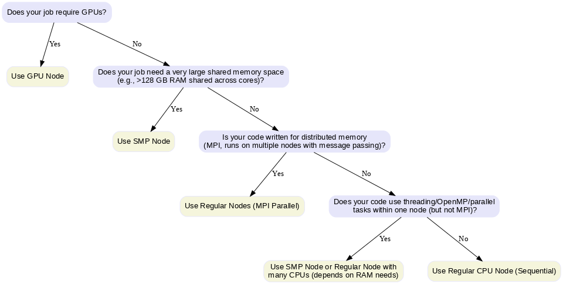

## Understanding Resource Requirements

#### Different computational tasks have varying resource requirements. Understanding these patterns is crucial for efficient HPC usage.

### Types of Workloads

**CPU-bound workloads**: Tasks that primarily use computational power
- Mathematical calculations, simulations, data processing
- Benefit from more CPU cores and higher clock speeds

**Real-world astronomy example:**  
Calculating theoretical stellar evolution tracks using the **MESA** code.  
Each star's model requires intense numerical integration of stellar structure equations over millions of time steps, mostly using the CPU.

---

**Memory-bound workloads**: Tasks limited by memory access speed
- Large dataset processing, in-memory databases
- Require sufficient RAM and fast memory access

**Real-world astronomy example:**  
Processing full-sky Cosmic Microwave Background (CMB) maps from **Planck** at high resolution.  
The HEALPix maps are large, and operations like spherical harmonic transforms require large amounts of RAM to store intermediate matrices. Another example would be to calc

---

**I/O-bound workloads**: Tasks limited by disk or network operations
- File processing, database queries, data transfer
- Benefit from fast storage and network connections

**Real-world astronomy example:**  
Stacking thousands of raw Rubin Observatory images to improve signal-to-noise ratio for faint galaxy detection.  
The bottleneck is reading the large image files from storage and writing processed results back.

---

**GPU-accelerated workloads**: Tasks that can utilize parallel processing
- Machine learning, scientific simulations, image processing
- Require appropriate GPU resources and memory

**Real-world astronomy example:**  
Training a convolutional neural network to classify transient events in ZTF light curves.  
The matrix multiplications and convolutions benefit greatly from GPU acceleration.

---
## Types of Jobs and Resources

When you run work on an HPC cluster, your job’s **type** determines how it will be scheduled and what resources it will use. Broadly, jobs fall into three categories:  

- **Serial jobs**  
  These use a single CPU core (or sometimes a single thread) to run all calculations. They don’t require communication between multiple processes. They’re ideal for workloads like simple data analysis, single-threaded simulations, or testing code.  

- **Parallel jobs**  
  These use multiple CPU cores — sometimes across multiple nodes — to run tasks simultaneously. Parallel jobs often use MPI (Message Passing Interface) or OpenMP explained in the previous section to coordinate work. They’re suited for large-scale simulations or computations that can be split into many parts running at once.  

- **GPU jobs**  
  These use Graphics Processing Units to accelerate certain types of workloads, especially those involving heavy numerical computation like deep learning, image processing, or large matrix operations. GPU jobs often also use CPU cores for parts of the workflow.  

Once you know your job type, you can select the correct **SLURM partition** (queue) and request the right resources:  

| Job Type   | SLURM Partition | Key SLURM Options              | Example Use Case            |
|------------|------------------|-------------------------------|-----------------------------|
| Serial     | `serial`         | `--partition`, no MPI         | Single-thread tensor calc   |
| Parallel   | `defaultq`       | `-N`, `-n`, `mpirun`          | MPI simulation              |
| GPU        | `gpu`            | `--gpus`, `--cpus-per-task`   | Deep learning training      |

## Choosing the Right Node
- **Regular Node**: For MPI-based distributed jobs or simple CPU tasks.
- **SMP Node** (*Symmetric Multiprocessing*): For jobs needing large shared memory (big matrices, in-memory data) or    multi-threaded code (OpenMP, R, Python multiprocessing).  
  - In an SMP system, multiple CPUs (cores) share the same physical memory and can access it at the same speed. This architecture is ideal when tasks need frequent access to a common memory space without the communication overhead of distributed systems.
- **GPU Node**: For massively parallel computations on GPUs (e.g., CUDA, TensorFlow, PyTorch).

**Decision chart for Choosing Nodes:**

<!-- > ## Exercise: Classify the Job Type
>
> Using the decision chart above, classify each of the following tasks into **CPU-bound**, **Memory-bound**, **I/O-bound**, or **GPU-accelerated**, and suggest the most appropriate node type.
>
> 1. Running an MPI-based cosmological parameter estimation using **cobaya** utilizing the functionality of **camb** and **class**.
> 2. Performing Bayesian inference on gravitational wave signals using **Bilby** with large nested sampling runs in parallel.
> 3. Stacking multi-night Rubin Observatory images to search for faint Kuiper Belt objects.
> 4. Training a deep learning model to classify galaxy morphologies from Hubble Space Telescope images.
> 5. Computing high-resolution spherical harmonic transforms for a CMB map from **Planck**.
>
> **Discussion:**  
> Compare your classifications with others in your group. Are there cases where more than one classification could apply? How would resource availability in the HPC cluster affect your choice?
{: .challenge}

## Solutions

1. **MPI-based cosmological parameter estimation using **cobaya**  
   - **Type:** CPU-bound (and parallel)  
   - **Reason:** Heavy numerical force calculations; distributed memory with MPI.  
   - **Node type:** Regular node (multi-node MPI).  
   - **SLURM options:** Use `-N` and `-n` for number of nodes and MPI tasks.

---

2. **Bayesian inference on gravitational wave signals using Bilby with large nested sampling runs in parallel**  
   - **Type:** CPU-bound (parallel, embarrassingly parallel per likelihood evaluation)  
   - **Reason:** Many likelihood calls, heavy math, but minimal shared memory need.  
   - **Node type:** Regular node (multi-core CPU), or SMP node if shared memory benefits.  
   - **SLURM options:** `--cpus-per-task` for OpenMP or `-n` for MPI depending on sampler.

---

3. **Stacking multi-night Rubin Observatory images to search for faint Kuiper Belt objects**  
   - **Type:** I/O-bound  
   - **Reason:** Bottleneck is reading/writing large image files and combining them; CPU is secondary.  
   - **Node type:** Regular node with fast storage access (or node close to data).  
   - **SLURM options:** Focus on storage bandwidth rather than CPU count.

---

4. **Training a deep learning model to classify galaxy morphologies from Hubble Space Telescope images**  
   - **Type:** GPU-accelerated  
   - **Reason:** Convolutional neural networks run much faster on GPUs.  
   - **Node type:** GPU node.  
   - **SLURM options:** `--gpus` to request the number of GPUs, and `--cpus-per-task` for data preprocessing.

---

5. **Computing high-resolution spherical harmonic transforms for a CMB map from Planck**  
   - **Type:** Memory-bound  
   - **Reason:** Large intermediate matrices require significant RAM; speed limited by memory access.  
   - **Node type:** SMP node (large shared memory).  
   - **SLURM options:** `--mem` to request enough RAM; `--cpus-per-task` if multithreaded.

---

**Possible discussion points for participants:**
- Some workloads are *mixed-type*: e.g., CMB transforms are both CPU-intensive and memory-bound.  
- In practice, HPC resource choice may depend on **queue wait times** as well as technical fit.  
- For I/O-bound tasks, software-level optimizations (e.g., caching, parallel I/O) can reduce bottlenecks. -->

## Exercise: Classify the Job Type

> Using the decision chart above, classify each of the following HPC tasks into **CPU-bound**, **Memory-bound**, **I/O-bound**, or **GPU-accelerated**, and suggest the most appropriate node type.

1. Running a **grid of supernova explosion models**, varying the star mass, explosion energy, circumstellar density, and radius. Each model runs independently on a separate CPU.

2. Simulating the **galactic stellar population** across many spatial grid points for the entire galactic plane. Each grid point is independent; results are aggregated at the end.

3. Running the **2D-Hybrid pipeline** for periodicity detection on ZTF DR6 quasar light curves:
   - Processing objects in batches of 1000 per job.
   - Each object is analyzed with wavelet + cross-band methods.

4. Simulating and fitting **microlensing light curves**, where each fit is run on a separate CPU, and runtime varies between light curves.

5. Distributing **difference imaging runs** for transient detection using PyTorch, previously run on GPUs, or via MPI/HTCondor.

> **Discussion:**  
> Are some tasks “mixed-type”? Which resources are more critical for performance? How would you prioritize CPU vs GPU vs memory for these workloads?

---

## Instructor Notes: Answer Key

1. **Grid of supernova explosion models**  
   - **Type:** CPU-bound (parallel)  
   - **Reason:** Each model is independent; heavy numerical computations per model.  
   - **Node type:** Regular node (multi-core CPU).  
   - **SLURM options:** Use multiple CPUs; each job in the array runs a separate model with `--array=1-100`.

---

2. **Galactic stellar population simulation**  
   - **Type:** CPU-bound (embarrassingly parallel)  
   - **Reason:** Each spatial grid point is independent; computation-heavy but not memory-intensive.  
   - **Node type:** Regular node or multi-node if very large. CPUs are sufficient.  
   - **SLURM options:** Distribute grid points across CPU cores; use MPI or job arrays with `--ntasks=64`.

---

3. **2D-Hybrid pipeline for ZTF quasar light curves**  
   - **Type:** CPU-bound (parallel)  
   - **Reason:** Wavelet + cross-band analysis is CPU-only; each batch processed independently.  
   - **Node type:** Regular node (multi-core CPU).  
   - **SLURM options:** Array jobs with `--cpus-per-task` for intra-batch parallelization.

---

4. **Microlensing light curve fitting**  
   - **Type:** CPU-bound (parallel, varying runtimes)  
   - **Reason:** Each light curve fit is independent; some fits take longer than others.  
   - **Node type:** Regular node or SMP node if shared memory needed for multithreaded fits.  
   - **SLURM options:** Array jobs with `--array=1-999` for fitting all light curves. 

---

5. **Difference imaging runs with PyTorch / MPI / HTCondor**  
   - **Type:** GPU-accelerated (if using PyTorch) or CPU-bound (MPI/HTCondor alternative)  
   - **Reason:** GPU use accelerates image subtraction; MPI/HTCondor distributes CPU tasks efficiently.  
   - **Node type:** GPU node (for PyTorch) or regular nodes (for MPI/HTCondor).  
   - **SLURM options:** `--gpus` for GPU tasks, `-N`/`-n` for MPI tasks.

---

**Discussion points for participants:**
- Many astrophysical workflows are **embarrassingly parallel**: independent tasks make CPU arrays ideal.  
- GPU acceleration is useful for highly parallel numerical tasks like image processing or ML, but not for CPU-only algorithms (wavelet analysis).  
- Mixed workloads may require careful resource monitoring (e.g., varying runtime fits).  


